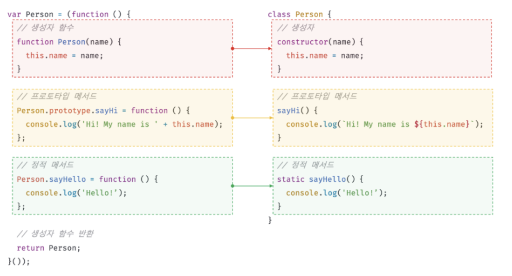
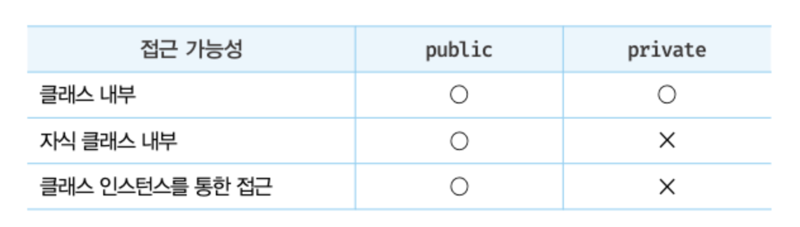
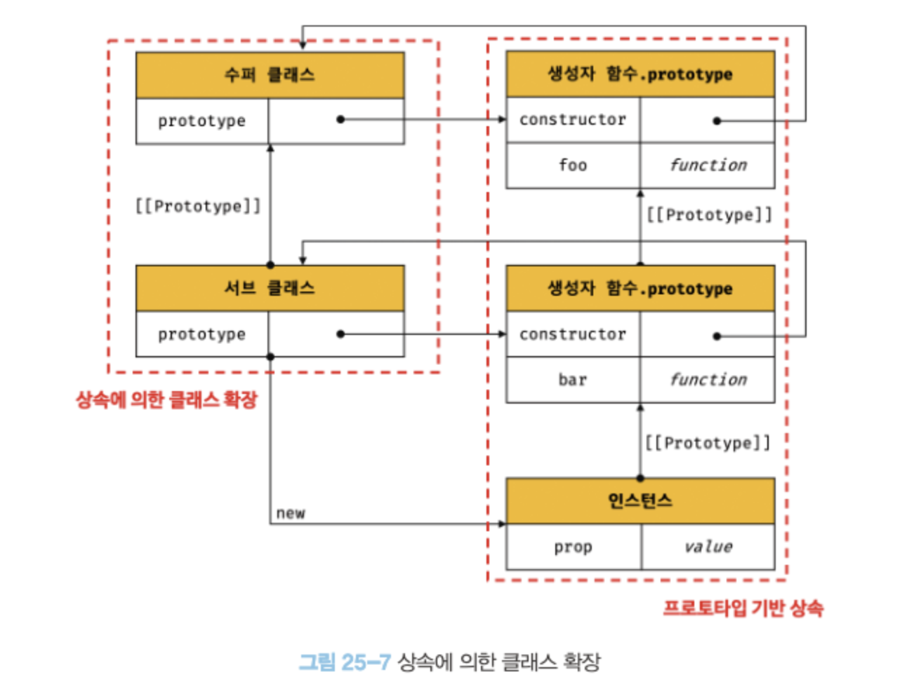
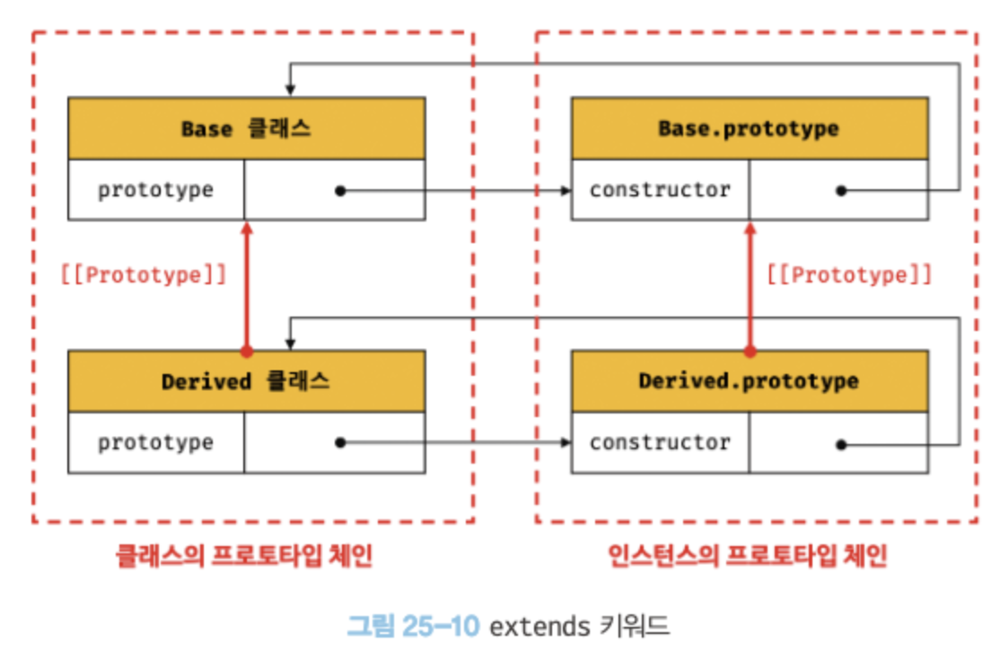

# 25장. 클래스

## 25.1 클래스는 프로토타입의 문법적 설탕인가?

- ES6에서 도입됨
- 클래스는 함수이며 기존 프로토타입 기반 패턴을 클래스 기반 패턴처럼 사용할 수 있도록 하는 문법적 설탕이라고 볼 수 있다.
- 클래스와 생성자 함수는 모두 프로토타입 기반의 인스턴스를 생성하지만 정확히 동일하게 동작하지는 않는다. 클래스는 생성자 함수 보다 엄격하며 생성자 함수에서는 제공하지 않는 기능도 제공한다.

## 25.2 클래스의 정의

class 키워드를 사용하여 정의한다. 클래스 이름은 파스칼 케이스를 사용하는 것이 일반적이지만 사용하지 않아도 에러 x

```js
//클래스 선언문
class Person {}
```

일반적이지 않지만 함수와 마찬가지로 표현식으로 클래스를 정의할 수도 있다. 이름을 가질수도 있고, 갖지 않을 수도 있다.

```js
//일반 클래스 표현식
const Person = class {};

//기명 클래스 표현식
const Person = class MyClass {};
```

클래스는 일급 객체로서 다음과 같은 특징을 갖는다.

- 무명의 리터럴로 생성할 수 있다. 즉, 런타임에 생성이 가능하다.
- 변수나 자료구조(객체, 배열 등)에 저장할 수 있다.
- 함수의 매개변수에게 전달할 수 있다.
- 함수의 반환값으로 사용할 수 있다.

클래스와 생성자 함수의 정의 방식 비교


## 25.3 클래스 호이스팅

- 클래스는 함수로 평가된다.
- 클래스 선언문으로 정의한 클래스는 함수 선언문과 같이 소스코드 평가 과정, 즉 런타임 이전에 먼저 평가되어 함수 객체를 생성한다. 이때 클래스가 평가되어 생성되어 생성된 함수 객체는 생성자 함수로서 호출할 수 있는 함수, 즉 constructor다. constructor는 함수 정의가 평가되어 함수 객체를 생성하는 시점에 프로토타입도 더불어 생성된다. 프로토타입과 생성자 함수는 단독으로 존재할 수 없고 언제나 쌍으로 존재하기 때문이다.
- 클래스는 클래스 정의 이전에 참조할 수 없다.
- 클래스 선언문은 마치 호이스팅이 발생하지 않는 것처럼 보이나 그렇지 않다.
- var, let, const, function, function\*, class 키워드를 사용하여 선언된 모든 식별자는 호이스팅된다. 모든 선언문은 런타임 이전에 먼저 실행되기 때문이다.

## 25.4 인스턴스 생성

- 클래스는 생성자 함수이며 new 연산자와 함께 호출되어 인스턴스를 생성한다.

  ```js
  class Person{}

    //인스턴스 생성
    cosnt me = new Person();
    console.log(me); // Person{}

  ```

  함수는 new 연산자의 사용 여부에 따라 일반 함수로 호출되거나 인스턴스 생성을 위한 생성자 함수로 호출되지만 클래스는 인스턴스를 생성하는 것이 유일한 존재 이유이므로 반드시 new 연산자와 함께 호출해야 한다.

- 클래스 표현식으로 정의된 클래스의 경우 클래스를 가리키는 식별자를 사용해 인스턴스를 생성하지 않고 기명 클래스 표현식의 클래스 이름을 사용해 인스턴스를 생성하면 에러가 발생한다. 클래스 표현식에서 사용한 클래스 이름은 외부 코드에서 접근 불가능하기 때문이다.

## 25.5 메서드

클래스 모체에는 0개 이상의 메서드만 선언할 수 있다. 클래스 몸체에서 정의할 수 있는 메서드는 constructor(생성자), 프로토타입 메서드, 정적 메서드의 세가지가 있다.

### 25.5.1 constructor

constructor는 인스턴스를 생성하고 초기화하기 위한 특수 메서드다. constructor는 이름을 변경할 수 없다.

```js
class Person {
  //생성자
  constructor(name) {
    //인스턴스 생성 및 초기화
    this.name = name;
  }
}
```

- 모든 함수 객체가 가지고 있는 prototype 프로퍼티가 가리키는 프로토타입 객체의 constructor 프로퍼티는 클래스 자신을 가리키고 있다. 이는 클래스가 인스턴스를 생성하는 생성자 함수라는 것을 의미한다. 즉, new 연산자와 함께 클래스를 호출하면 클래스는 인스턴스를 생성한다.
- 생성자 함수와 마찬가지로 constructor 내부에서 this에 추가한 프로퍼티는 인스턴스 프로퍼티가 된다. constructor 내부의 this는 생성자 함수와 마찬가지로 클래스가 생성한 인스턴스를 가리킨다.
- 클래스 몸체에 정의한 constructor는 단순한 메서드가 아니다.
  - constructor는 메서드로 해석되는 것이 아니라 클래스가 평가되어 생성한 함수 객체 코드의 일부가 된다. 즉, **클래스 정의가 평가되면 constructor의 기술된 동작을 하는 함수 객체가 생성된다.**
- constructor는 생성자 함수와 유사하지만 몇 가지 차이가 있다.
  - constructor는 클래스 내에 최대 한개만 존재할 수 있다. 만약 클래스가 2개 이상의 constructor를 포함하면 문법 에러가 발생한다.
  - constructor는 생략할 수 있다. 생략하면 클래스에 빈 constructor가 암묵적으로 정의된다. constructor를 생략한 클래스는 빈 constructor에 의해 빈 객체를 생성한다. 인스턴스를 초기화하려면 constructor를 생략해서는 안 된다.
  - constructor 내부에서는 return문을 반드시 생략해야한다. constructor 내부에서 명시적으로 this가 아닌 다른 값을 반환하는 것은 클래스의 기본 동작을 훼손하기 때문이다.

### 25.5.2 프로토타입 메서드

- 생성자 함수를 사용하여 인스턴스를 생성하는 경우 프로토타입 메서드를 생성하기 위해서는 명시적으로 프로토타입에 메서드를 추가해야 한다.
- 클래스 몸체에서 정의한 메서드는 생성자 함수에 의한 객체 생성 방식과는 다르게 클래스의 prototype 프로퍼티에 메서드를 추가하지 않아도 기본적으로 프로토타입 메서드가 된다.
- 클래스가 생성한 인스턴스는 프로토타입 체인의 일원이다.
- 클래스 몸체에서 정의한 메서드는 인스턴스의 프로토타입에 존재하는 프로토타입 메서드가 된다. 인스턴스는 프로토타입 메서드를 상속받아 사용할 수 있다.
- 프로토타입 체인은 기존의 모든 객체 생성 방식뿐만 아니라 클래스에 의해 생성된 인스턴스에도 동일하게 적용된다.
- 클래스는 생성자 함수와 마찬가지로 프로토타입 기반의 객체 생성 메커니즘이다.

### 25.5.3 정적 메서드

정적 메서드는 인스턴스를 생성하지 않아도 호출할 수 있는 메서드를 말한다.  
생성자 함수의 경우 정적 메서드를 생성하기 위해서는 다음과 같이 명시적으로 생성자 함수에 메서드를 추가해야 한다.

```js
//생성자 함수
function Person(name) {
  this.name = name;
}

//정적 메서드
Person.sayHi = function () {
  console.log("Hi!");
};

//정적 메서드 호출
Person.sayHi(); //Hi!
```

클래스에서는 메서드에 static 키워드를 붙이면 정적 메서드(클래스 메서드)가 된다.

```js
class Person {
  //생성자
  constructor(name) {
    //인스턴스 생성 및 초기화
    this.name = name;
  }

  //정적 메서드
  static sayHi() {
    console.log("Hi!");
  }
}
```

- 정적 메서드는 클래스에 바인딩된 메서드가 된다.
- 클래스는 함수 객체로 평가되므로 자신의 프로퍼티/메서드를 소유할 수 있다.
- 정적 메서드는 클래스 정의 이후 인스턴스를 생성하지 않아도 호출할 수 있다.

### 25.5.4 정적 메서드와 프로토타입 메서드의 차이

1. 정적 메서드롸 프로토타입 메서드는 자신이 속해 있는 프로토타입 체인이 다르다.
2. 정적 메서드는 클래스로 호출하고 프로토타입 메서드는 인스턴스로 호촐한다.
3. 정적 메서드는 인스턴스 프로퍼티를 참조할 수 없지만 프로토타입 메서드는 인스턴스 프로퍼티를 참조할 수 있다.

### 25.5.5 클래스에서 정의한 메서드의 특징

1. function 키워드를 생략한 메서드 축약 표현을 사용한다.
2. 객체 리터럴과는 다르게 클래스에 메서드를 정의할 때는 콤마가 필요 없다.
3. 암묵적으로 strict mode로 실행된다.
4. for...in 문이나 Object.keys 메서드 등으로 열거할 수 없다. 즉, 프로토타입의 열거 가능 여부를 나타내며, 불리언 값을 갖는 프로퍼티 어트리뷰트 [[Enumerable]]의 값이 false다.
5. 내부 메서드 [[Construct]]를 갖지 않는 non-constructor다. 따라서 new 연산자와 함께 호출할 수 없다.

## 25.6 클래스의 인스턴스 생성 과정

1. 인스턴스 생성과 this 바인딩
2. 인스턴스 초기화
3. 인스턴스 반환

## 25.7 프로퍼티

### 25.7.1 인스턴스 프로퍼티

- 인스턴스 프로퍼티는 constructor 내부에서 정의햐야 한다.
- 생성자 함수에서 생성자 함수가 생성할 인스턴스의 프로퍼티를 정의하는 것과 마찬가지로 constructor 내부에서 this에 인스턴스 프로퍼티를 추가한다. 이로써 클래스가 암묵적으로 생성한 빈 객체, 즉 인스턴스에 프로퍼티가 추가되어 인스턴스가 초기화 된다.

### 25.7.2 접근자 프로퍼티

- 전근자 프로퍼티는 자체적으로는 값을 갖지 않고 다른 데이터 프로퍼티의 값을 읽거나 정의할 때 접근자 함수로 구성된 프로퍼티다.
- getter함수와 setter함수로 구성되어 있다
  - getter: 인스턴스 프로퍼티에 접근할 때마다 프로퍼티 값을 조작하거나 벼도의 행위가 필요할 떄 사용. 메서드 앞에 get 키워드를 사용해 정의한다.
  - setter: 인스턴스 프로퍼티에 값을 할당할 때마다 프로퍼티 값을 조작하거나 별도의 행위가 필요할 때 사용. 메서드 이름 앞에 set 키워드를 사용해 정의한다.
  - getter와 setter 이름은 인스턴스 프로퍼티처럼 사용된다.

### 25.7.3 클래스 필드 정의 제안

- 클래스 필드: 클래스 기반 객체 지향 언어에서 클래스가 생성할 인스턴스의 프로퍼티를 가리키는 용어.
- 인스턴스를 생성할 때 외부 초기값으로 클래스 필드를 초기화할 필요가 있다면 constructor에서 인스턴스 프로퍼티를 정의하는 기존방식 사용
- 인스턴스를 생성할 때 외부 초기값으로 클래스 필드를 초기화할 필요가 없다면 기존의 constructor에서 인스턴스 프로퍼티를 정의하는 방식과 클래스 필드 정의 제안 모두 사용 가능.

### 25.7.4 private 필드 정의 제안

- 인스턴스 프로퍼티는 인스턴스를 통해 클래스 외부에서 언제나 참조할 수 있다. 즉, 언제나 public이다. 클래스 필드 정의 제안을 사용하더라도 클래스 필드는 기본적으로 public하기 때문에 외부에 그대로 노출된다.
- private 필드의 건두에는 #을 붙여준다. private 필드를 참조할 때도 #을 붙여줘야 한다.
- public필드는 어디서든 참조할 수 있지만 private 필드는 클래스 내부에서만 참조할 수 있다. 접근자 프로퍼티를 통해 간접적으로 접근하는 방법은 유효하다.
  
- private 필드는 반드시 클래스 몸체에 정의해야 한다. 직접 constructor에 정의하면 에러가 발생한다.

## 25.8 상속에 의한 클래스 확장

### 25.8.1 클래스 상속과 생성자 함수 상속

상속에 의한 클래스 확장은 기존 클래스를 상속받아 새로운 클래스를 확장하여 정의하는 것이다.


- 클래스는 상속을 통해 기존 클래스를 확장할 수 있는 문법이 기본적으로 제공되지만 생성자 함수는 그렇지 않다.

### 25.8.2 extends 키워드

상속을 통해 클래스를 확장하려면 extends 키워드를 사용하여 상속받을 클래스를 정의한다.

```js
// 수퍼(베이스/부모)클래스
class Base {}

//서브(파생/자식)클래스
class Derived extends Base {}
```

서브클래스: 상속을 통해 확장된 클래스.  
수퍼클래스: 서브클래스에게 상속된 클래스.

- extends 키워드의 역할은 수퍼클래스와 서브클래스 간의 상속 관계를 성정하는 것이다. 클래스도 프로토타입을 통해 상속 관계를 구현한다.
  

### 25.8.3 동적 생성

- extends 키워드는 클래스뿐만 아니라 생성자 함수를 상속받아 클래스를 확장할 수도 있다. 단 extends 키워드 앞에는 반드시 클래스가 와야 한다.
- extends 키워드 다음에는 클래스 뿐만아니라 [[Construct]] 내부 메서드를 갖는 함수 객체로 평가될 수 있는 모든 표현식을 사용할 수 있다. 이를 통해 동적으로 상속받을 대상을 결정할 수 있다.

### 25.8.4 서브클래스의 constructor

클래스에서 constructor를 생략하면 클래스에 다음과 같이 비어 있는 constructor가 암묵적으로 정의된다.

```js
constructor() {}
```

서브 클래스에서 constructor를 생략하면 클래스에 다음과 같은 constructor가 암묵적으로 정의된다. args는 new 연산자와 함께 클래스를 호출할 때 전달할 인수의 리스트다.

```js
constructor(...args) {super(...args);}

```

- super()는 수퍼클래스의 constructor(super-constructor)를 호출하여 인스턴스를 생성한다.
- 수퍼클래스와 서브클래스 모두 constructor를 생략하면 빈 객체가 생성된다. 프로퍼티를 소유하는 인스턴스를 생성하려면 constructor 내부에서 인스턴스에 프로퍼티를 추가해야 한다.

### 25.8.5 super 키워드

super 키워드는 함수처럼 호출할 수도 있고 this와 같이 식별자처럼 참조할 수 있는 특수한 키워드다.  
super는 다음과 같이 동작한다.

- super를 호출하면 수퍼 클래스의 constructor(super-constructor)를 호출한다.
- super를 참조하면 수퍼클래스의 메서드를 호출할 수 있다.

#### super 호출

super를 호출하면 수퍼 클래스의 constructor(super-constructor)를 호출한다.

- 수퍼클래스의 constructor 내부에서 추가한 프로퍼티를 그대로 갖는 인스턴스를 생성한다면 서브클래스의 constructor를 생략할 수 있다. 이때 new 연산자와 함께 서브클래스를 호출하면서 전달한 인수는 모두 서브클래스에 암묵적으로 정의된 constructor의 super 호출을 통해 수퍼클래스의 constructor에 전달된다.
- 수퍼클래스에서 추가한 프로퍼티와 서브클래스에서 추가한 프로퍼티를 갖는 인스턴스를 생성한다면 서브클래스의 constructor를 생략할 수 없다. 이때 new 연산자와 함께 서브클래스를 호출하면서 전달한 인수 중에서 수퍼클래스의 constructor에 전달할 필요가 있는 인수는 서브클래스의 constructor에서 호출하는 super를 통해 전달한다.
- 인스턴스 초기화를 위해 전달한 인수는 수퍼클래스와 서브클래스에 배분되고 상속 관계의 두 클래스는 서로 협력하여 인스턴스를 생성한다.
- super를 호출할 때 주의할 사항
  1.  서브클래스에서 constructor를 생략하지 않는 경우 서브클래스의 constructor에서는 반드시 super를 호출해야 한다.
  2.  서브클래스의 constructor에서 super를 호출하기 전에는 this를 참조할 수 없다.
  3.  super는 반드시 서브클스의 constructor에서만 호출한다. 서브클래스가 아닌 클래스의 constructorsk 함수에서 super를 호출하면 에러가 발생한다.

#### super 참조

메서드 내에서 super를 참조하면 수퍼클래스의 메서드를 호출할 수 있다.

### 25.8.6 상속 클래스의 인스턴스 생성 과정

1. 서브클래스의 super 호출
   - 서브클래스는 자신이 직접 인스턴스를 생성하지 않고 수퍼클래스에게 인스턴스 생성을 위임한다. 이것이 서브클래스의 constructor에서 반드시 super를 호출해야 하는 이유다.
2. 수퍼클래스의 인스턴스 생성과 this 바인딩
   - 수퍼클래스의 constructor 내부의 코드가 실행되기 이전에 암묵적으로 빈객체를 생성한다. 이 빈 객체가 클래스가 생성한 인스턴스다. 그리고 암묵적으로 생성된 객체, 즉 인스턴스는 this에 바인딩된다. 따라서 수퍼클래스의 constructor 내부의 this는 생성된 인스턴스를 가리킨다.
3. 수퍼클래스의 인스턴스 초기화
   - 수퍼클래스의 constructor가 실행되어 this에 바인딩되어 있는 인스턴스를 초기화한다. 즉, this에 바인딩되어 있는 인스턴스에 프로퍼티를 추가하고 constructor가 인수로 전달받은 초기값으로 인스턴스의 프로퍼티를 초기화한다.
4. 서브클래스 constructor로의 복귀와 this 바인딩
   - super의 호출이 종료되어 제어 흐름이 서브클래스 constructor로 돌아온다. 이때 super가 반환한 인스턴스가 this에 바인딩된다. 서브클래스는 별도의 인스턴스를 생성하지 않고 super가 반환한 인스턴스를 this에 바인딩하여 그대로 사용한다.
   - super가 호출되지 않으면 인스턴스가 생성되지 않으며, this 바인딩도 할 수 없다.
5. 서브클래스의 인스턴스 초기화
   - super 호출 이후, 서브클래스의 constructor에 기술되어 있는 인스턴스 초기화가 실행된다. 즉, this 바인딩되어 있는 인스턴스에 프로퍼티를 추가하고 constructor가 인수로 전달받은 초기값으로 인스턴스의 프로퍼티를 초기화한다.
6. 인스턴스 반환
   - 클래스의 모든 처리가 끝나면 완성된 인스턴스가 바인딩된 this가 암묵적으로 반환된다.

### 25.8.7 표준 빌트인 생성자 함수

- extends 키워드 다음에는 클래스뿐만이 아니라 [[Construct]] 내부 메서드를 갖는 함수 객체로 평가될 수 있는 모든 표현식을 사용할 수 있다. String, Number, Array 같은 표준 빌트인 객체도 [[Construct]] 내부 메서드를 갖는 생성자 함수이므로 extends 키워드를 사용하여 확장할 수 있다.
