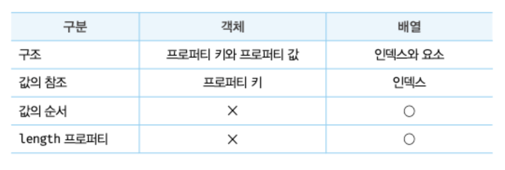
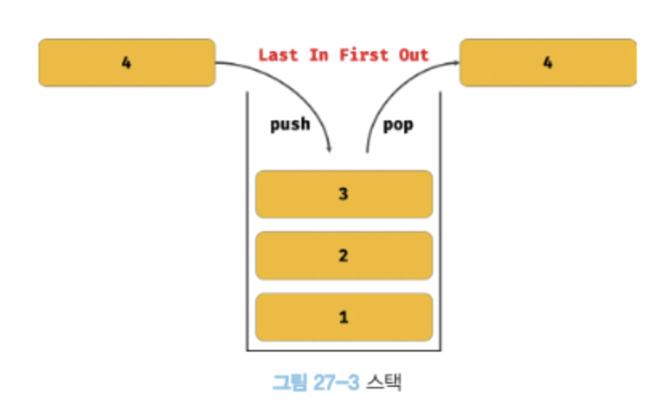
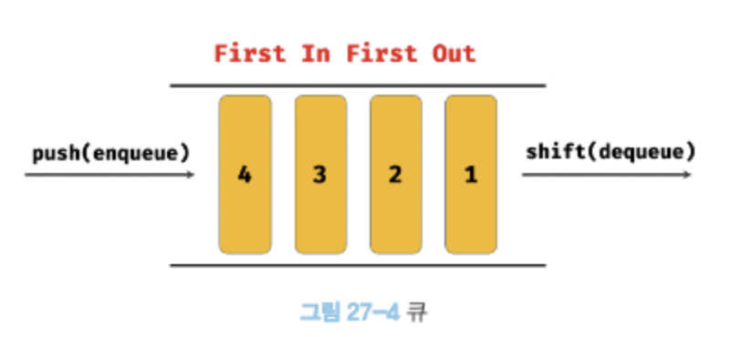
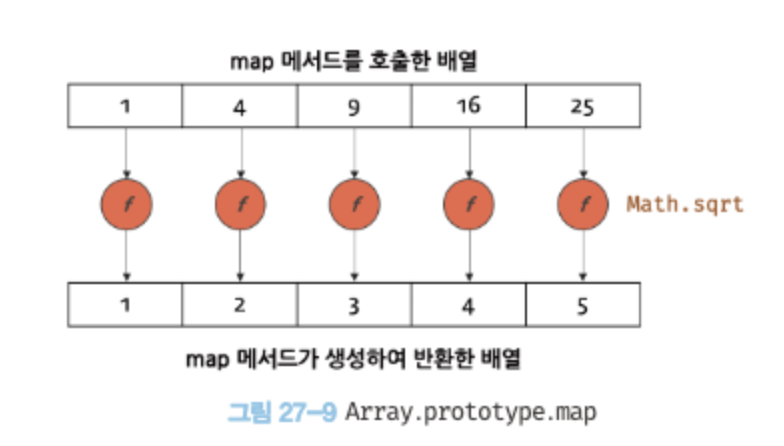
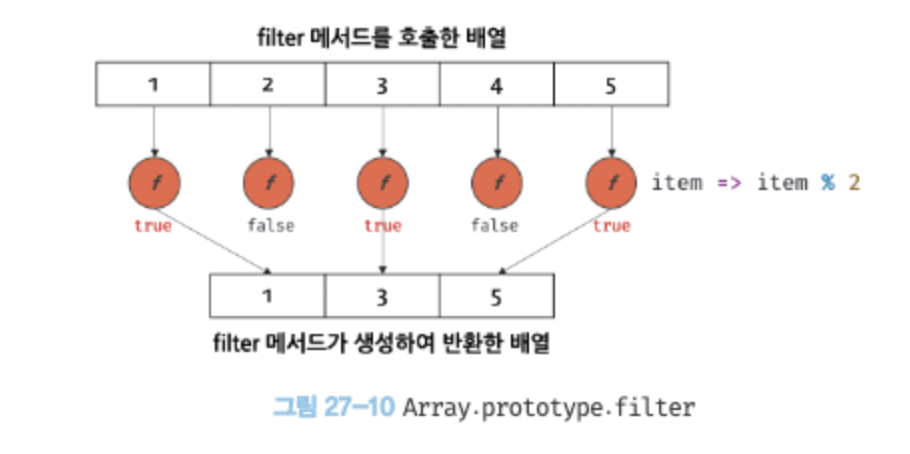

# 27장. 배열

## 27.1 배열이란?

배열은 여러개의 값을 순차적으로 나열한 자료구조다.

- 요소: 배열이 가지고 있는 값
- 인덱스: 배열의 요소는 배열에서 자신의 위치를 나타내는 0이상의 정수인 인덱스를 갖는다. 배열의 요소에 접근할 때 사용. 0부터 시작.
- length 프로퍼티: 배열의 길이를 나타냄.

for문을 통해 순차적으로 요소에 접근할 수 있다.

```js
for (let i = 0; i < arr.length; i++) {
  console.lg(arr[i]);
}
```

자바스크립트에 배열이라는 타입은 존재하지 않는다. 배열은 객체 타입이다.

```js
typeof arr; // object
```

배열은 배열 리터럴, Array 생성자 함수, Array.of, Array.from 메서드로 생성할 수 있다. 배열릐 생성자 함수는 Array이며, 배열의 프로토타입 객체는 Array.Prototype이다. Array.Prototype은 배열을 위한 빌트인 메서드를 제공한다.

배열은 객체지만 일반 객체와는 구별되는 독특한 특징이 있다.


배열의 장점

- 처음부터 순차적으로 요소에 접근할 수도 있고, 마지막부터 역순으로 요소에 접근할 수도 있다
- 특정 위치부터 순차적으로 요소에 접근할 수도 있다.
- 배열이 인덱스, 즉 값의 순서와 length 프로퍼티를 갖기 때문에 가능한 것이다.

## 27.2 자바스크립트 배열은 배열이 아니다.

- 배열의 요소는 하나의 데이터 타입으로 통일되어 있으며 서로 연속적으로 인접해 있다. 이러한 배열을 밀집 배열이라 한다.
  
- 희소 배열: 배열의 요소가 연속적으로 이어져 있지 않은 배열
- 자바스크립트의 배열은 일반적인 배열의 동작을 흉내 낸 특수한 객체다.
  - 자바스크립트 배열은 인덱스를 나타내는 문자열을 프로퍼티 키로 가지며, length 프로퍼티를 갖는 특수한 객체다.
  - 자바스크립트 배열의 요소는 사실 프로퍼티 값이다.
  - 자바스크립트에서 사용할 수 있는 모든 값은 객체의 프로퍼티 값이 될 수 있으므로 어떤 타입의 값이라도 배열의 요수가 될 수 있다.
- 일반적인 배열과 자바스크립트 배열의 장단점
  - 일반적인 배열은 인덱스로 요소에 빠르게 접근할 수 있다. 하지만 요소를 삽입 또는 삭제하는 경우에는 효율적이지 않다.
  - 자바스크립트 배열은 해시 테이블로 구현된 객체이므로 인덱스로 요소에 접근하는 경우 일반적인 배열보다 성능적인 면에서 느릴 수밖에 없는 구조적인 단점이 있다. 하지만 요소를 삽입 또는 삭제하는 경우에는 일반적인 배열보다 빠른 성능을 기대할 수 있다.

## 27.3 length 프로퍼티와 희소 배열

- length 프로퍼티는 요소의 개수, 즉 배열의 길이를 나타내는 0이상의 정수를 값으로 갖는다.
- length 프로퍼티의 값은 빈 배열일 경우 0이며, 빈 배열이 아닐 경우 가장 큰 인덱스에 1을 더한 것과 같다.
- length 프로퍼티의 값은 배열에 요소를 추가하거나 삭제하면 자동 갱신된다.
- length 프로퍼티 값은 요소의 개수, 즉 배열의 길이를 바탕으로 결정되지만 임의의 숫자 값을 명시적으로 할당할 수도 있다.
  - 현재 length 프로퍼티 값보다 작은 숫자 값을 할당하면 배열의 길이가 줄어든다.
  - 현재 length 프로퍼티 값보다 큰 숫자 값을 할당하는 경우 length 프로퍼티 값은 변경되지만 실제로 배열의 길이가 늘어나지는 않는다.

희소배열

- 일반적인 배열의 length는 배열 요소의 개수, 즉 배열의 길이와 언제나 일치한다. 하지만 희소 배열은 length와 배열 요소의 개수가 일치하지 않는다.
- 희소 배열의 length는 희소 배열릐 실제 요소 개수보다 언제나 크다.
- 자바스크립트는 문번적으로 희소배열을 허용하지만 사용하지 않는 것이 좋다. 희소 배열은 연속적인 값의 집합이라는 배열의 기본적인 개념과 맞지 안으며, 성능에도 좋지 않은 영향을 준다.
- 배열에는 같은 타입의 요소를 연속적으로 위치시키는 것이 최선이다.

## 27.4 배열 생성

### 27.4.1 배열 리터럴

가장 일반적이고 간편한 배열 생성방식은 배열 리터럴을 사용하는 것이다.

```js
const arr = [1, 2, 3];
console.log(arr.length); //3
```

### 27.4.2 Array 생성자 함수

Array 생성자 함수는 전달된 개수에 따라 다르게 동작하므로 주의가 필요하다.

- 전달된 인수가 1개이고 숫자인 경우 length 프로퍼티 값이 인수인 배열을 생성한다.

  ```js
  const arr = new Array(10);

  console.log(arr); // [empty * 10]
  console.log(arr.length); //10
  // 이때 생성된 배열은 희소 배열이다. length프로퍼티 값은 0이 아니지만 실제로 배열의 요소는 존재하지 않는다.
  ```

- 전달된 인수가 없는 경우 빈 배열을 생성한다.
- 인수가 2개 이상이거나 숫자가 아닌경우 인수를 요소로 갖는 배열 생성

  ```js
  new Array(1, 2, 3); //[1,2,3]

  new Array({}); //[{}]
  ```

- Array 생성자 함수는 new 연산자와 함께 호출하지 않더라도, 즉 일반 함수로서 호출해도 배열을 생성하는 생성자 함수로 동작한다. 이는 Array 생성자 함수 내부에서 new.target을 확인하기 때문이다.

### 27.4.3 Array.of

- ES6에서 도입됨
- 전달된 인수를 요소로 갖는 배열을 생성한다.
- Array 생성자 함수와 다르게 전달된 인수가 1개이고 숫자이더라도 인수를 요소로 갖는 배열을 생성한다.
  ```js
  Array.of(1); // [1]
  Array.of(1, 2, 3); // [1,2,3]
  Array.of("string"); // [string]
  ```

### 27.4.4 Array.from

- ES6에서 도입됨
- 유사 배열 객체 또는 이터러블 객체를 인수로 전달 받아 배열로 변환하여 반환한다.

  ```js
  Array.from({ length: 2, 0: "a", 1: "b" }); //['a' , 'b']
  Array.from("Hello"); //['H','e','l','l','o']

  //length만 존재하는 유사 배열 객체를 전달하면 undefined를 요소로 채운다.
  Array.from({ length: 3 }); // [undefined, undefined, undefined]

  //두번째 인수로 전달한 콜백 함수의 반환값으로 구성된 배열을 반환한다.
  Array.from({ length: 3 }, (_, i) => i); //[0,1,2]
  ```

## 27.5 배열 요소의 참조

- 대괄호([])표기법 사용

  ```js
  const arr = [1, 2];

  console.log(arr[0]); // 1
  ```

- 존재하지 않는 요소에 접근하면 undefined가 반환된다.

## 27.6 배열 요소의 추가와 갱신

- 배열 요소 추가

  ```js
  const arr = [0];

  arr[1] = 1;

  console.log(arr); //[0,1]
  console.log(arr.length); //2
  ```

- 만약 현재 배열릐 length 프로퍼티 값보다 큰 인덱스로 새로운 요소를 추가하면 희소 배열이 된다.

## 27.7 배열 요소의 삭제

배열은 사실 객체이기 때문에 배열의 특정 요소를 삭제하기 위해 delete 연산자를 사용할 수 있다.

```js
const arr = [1, 2, 3];

delete arr[1];
console.log(arr); // [1,empty,3]

//length 프로퍼티에 영향을 주지 않는다. 즉, 희소 배열이 된다.
console.log(arr.length); //3
```

- 희소 배열을 만들지 않고 특정 요소를 완전히 삭제하려면 Array.prototype.splice메서드 사용

  ```js
  const arr = [1, 2, 3];

  arr.splice(1, 1); // arr[1]부터 1개의 요소 제거
  console.log(arr); // [1,3]

  console.log(arr.length); //2
  ```

## 27.8 배열 메서드

### 27.8.1 Array.isArray

전달된 인수가 배열이면 true, 아니면 false 반환

### 27.8.2 Array.prototype.indexof

- 원본 배열에서 인수로 전달된 요소를 검색하여 인덱스를 반환한다.
- 인수로 전달한 요소와 중복되는 요소가 여러개 있다면 철 번째로 건색된 요소의 인덱스 반환
- 전달한 요소가 존재하지 않으면 -1 반환
- 특정 요소가 존재하는지 확인할 때 유용
- ES7에서 도입된 Array.prototype.includes 메서드를 사용하면 가독성이 더 좋음

### 27.8.3 Array.prototype.push

인수로 전달받은 모든 값을 원본 배열의 마지막 요소로 추가하고 변경된 length 프로퍼티 값을 반환한다. 원본 배열을 직접 변경한다.

- 마지막으로 추가할 요소가 하나뿐이라면 length 프로퍼티를 사용하는 것이 더 빠름

  ```js
  const arr = [1, 2];

  //arr.push(3)과 동일
  arr[arr.length] = 3;
  console.log(arr); //[1,2,3]
  ```

- push 메서드는 원본 배열을 직접 변경하는 부수효과가 있다. 따라서 ES6의 스프레드 문법을 사용하는 편이 좋다.

  ```js
  const arr = [1, 2];

  const newArr = [...arr, 3];
  console.log(newArr); //[1,2,3]
  ```

### 27.8.4 Array.prototype.pop

- 원본 배열에서 마지막 요소를 제거 하고 제거한 요소를 반환한다.
- 원본 배열이 빈 배열이면 undefined를 반환한다.
- pop 메서드는 원본 배열을 직접 변경한다.
- pop 메서드와 push 메서드를 사용하면 스택을 쉽게 구현할 수 있다.
  - 스택: 데이터를 마지막에 밀어 넣고, 마지막에 밀어 넣은 데이터를 먼저 꺼내는 후입 선출 방식의 자료구조.
    

### 27.8.5 Array.prototype.unshift

- 인수로 전달받은 모든 값을 원본 배열의 선두에 요소로 추가하고 변경된 length 프로퍼티 값을 반환한다.
- 원본 배열을 직접 변경한다.

### 27.8.6 Array.prototype.shift

- 첫번째 요소를 제거하고 제거한 요소를 반환한다.
- 빈배열이면 undefined
- 원본 배열 직접 변경
- shif와 push를 사용하면 큐를 쉽게 구현할 수 있다.
  - 큐: 데이터를 마지막에 밀어넣고, 처음 데이터, 즉 가장 먼저 밀어 넣은 데이터를 먼저 꺼내는 선입 선출 방식의 자료구조.
    

### 27.8.7 Array.prototype.concat

- 인수로 전달된 값들을 원본 배열의 마지막 요소로 추가한 새로운 배열 반환.
- 인수로 전달한 값이 배열인 경우 배열을 해체하여 새로운 배열의 요소로 추가한다.
- 원본 배영 변경 x
- push, unshift와의 차이
  - push와 unshift는 원본배열을 직접 변경하지만, concat은 변경하지 않고 새로운 배열 반환.
- ES6의 스프레드 문법으로 대체 가능

### 27.8.8 Array.prototype.splice

- 원본 배열의 중간에 요소를 추가하거나 중간에 있는 요수를 제가하는 경우에 사용
- 3개의 매개변수가 있으며 원본 배열을 직접 변경한다.

  ```js
  const arr = [1, 2, 3, 4];

  //원본 요소에 인덱스 1부터 2개의 요소를 제거하고 그 자리에 새로운 요소 20, 30을 삽입한다.
  const result = arr.splice(1, 2, 20, 30);
  ```

### 27.8.9 Array.prototype.slice

- 인수로 전달된 범위의 요소들을 복사하여 배열로 반환
- 원본 배열 변경 x
- 두개의 매개변수

  ```js
  const arr = [1, 2, 3];

  //arr[0]부터 arr[1] 이전(arr[1] 미포함)까지 복사하여 반환
  arr.slice(0, 1); //[1]
  ```

- 첫번 째 인수가 음수인 경우 배열의 끝에서부터 요소를 복사하여 배열로 반환
- 인수를 모두 생략하면 원본 배열의 복사본을 생성하여 반환(얕은 복사)

### 27.8.10 Array.prototype.join

- 원본 배열의 모든 요소를 문자열로 변환한 후, 인수로 전달 받은 문자열, 즉 구분자로 연결한 문자열을 반환한다. 구분자는 생략가능하며 기본 구분자는 콤마(,)다.

  ```js
  const arr = [1, 2, 3, 4];

  arr.join(); // '1,2,3,4'
  ```

### 27.8.11 Array.prototype.reverse

- 원본 배열의 순서를 반대로 뒤집는다
- 원본 배열이 변경된다.
- 반환값은 변경된 배열이다

### 27.8.12 Array.prototype.fill

- ES6에서 도입됨
- 인수로 전달받은 값을 배열의 처음부터 끝까지 요소로 채운다.
- 원본 배열이 변경된다.

  ```js
  const arr = [1, 2, 3];

  // 인수로 전달받은 값 0을 처음부터 끝까지 요소로 채운다
  arr.fill(0); // arr -> [0,0,0]
  ```

- 두번째 인수로 요소 채우기를 시작할 인덱스를 전달할 수 있다.

  ```js
  const arr = [1, 2, 3];

  // 인수로 전달받은 값 0을 인덱스 1부터 끝까지 요소로 채운다
  arr.fill(0, 1); // arr -> [1,0,0]
  ```

- 세번째 인수로 요소 채우기를 멈출 인덱스를 전달할 수 있다.

  ```js
  const arr = [1, 2, 3, 4, 5];

  // 인수로 전달받은 값 0을 인덱스 1부터 끝까지 요소로 채운다
  arr.fill(0, 1, 3); // arr -> [1,0,0,4,5]
  ```

- 단점: 모든 요소를 하나의 값으로만 채울 수 있음(Array.from메서드 사용으로 해결 가능)

### 27.8.13 Array.prototype.includes

- ES7에서 도입됨
- 배열 내에 특정 요소가 포함되어 있는지 확인하여 true 또는 false를 반환한다.

```js
const arr = [1, 2, 3];

//2가 포함되어 있는지 확인
arr.includes(2); //true

//1이 포함되어 있는지 인덱스 1부터 확인
arr.includes(1, 1); //false

//3이 포함되어 있는지 인덱스 2(arr.length-1)부터 확인
arr.includes(3, -1); //true
```

### 27.8.14 Array.prototype.flat

- ES10에서 도입
- 인수로 전달한 싶이만큼 재귀적으로 배열을 평탄화한다.
  ```js
  [1, [2, 3, 4, 5]].flat(); // -> [1,2,3,4,5]
  ```
- 중첩 배열을 평탄화 할 깊이를 인수로 전달할 수 있다. 생략할 경우 기본값은 1. Infinity를 전달하면 중첨 배열 모두를 평탄화 한다.

### 27.9 배열 고차 함수

### 27.9.1 Array.prototype.sort

- 배열의 요소 정렬
- 원본 배열 직접 변경
- 기본적으로 오름차순으로 정렬
- 내림차순으로 정렬하려면 sort 사용 후 reverse 사용
- 숫자 요소를 정렬할 때는 정렬 순서를 정의하는 비교 함수를 인수로 전달해야 한다.

  ```js
  const points = [40, 100, 1, 5, 2, 25, 10];

  //숫자 배열의 오름차순 정렬. 비교 함수의 반환값이 0보다 작으면 a를 우선하여 정렬
  points.sort((a, b) => a - b);

  //숫자 배열의 내림차순 정렬. 비교 함수의 반환값이 0보다 작으면 b를 우선하여 정렬
  points.sort((a, b) => b - a);
  ```

### 27.9.2 Array.prototype.forEach

- for문을 대체할 수 있는 고차함수
- 자신의 내부에서 반복문을 실행한다.
- 원본 배열을 변경하지 않는다. 하지만 콜백 함수를 통해 원본 배열을 변경할 수 있다.
- forEach 메서드의 반환값은 언제나 undefined다.
- 두 번째 인수로 forEach 메서드의 콜백 함수 내부에서 this로 사용할 객체를 전달할 수 있다.
- for문과 달리 break, continue문을 사용할 수 없다. 즉, 배열의 모든 요소를 빠짐 없이 모두 순회하며 중간에 순회를 중단할 수 없다.
- 희소 배열의 경우 존재하지 않는 요소는 순회 대상에서 제외된다.
- for문에 비해 성능이 좋지는 않지만 가독성은 좋다. 따라서 요소가 대단히 많은 배열을 순회하거나 시간이 많이 걸리는 복잡한 코드 또는 높은 성능이 필요한 경우가 아니라면 for문 대신 forEach 메서드를 사용할 것을 권장한다.

### 27.9.3 Array.prototype.map

- 자신을 호출한 배열의 모든 요소를 순회하면서 인수로 전달받은 콜백 함수를 반복 호출한다. 그리고 콜백 함수의 반환값들로 구성된 새로운 배열을 반환한다. 원본 배열 변경 x
- forEach 메서드와의 차이: forEach는 언제나 undefined를 반환하고, map은 콜백함수의 반환값들로 구성된 새로운 배열을 반환한다. 즉, forEach는 단순히 반복문을 대체하기 위한 고차 함수이고, map은 요소값을 다른 값으로 매핑한 새로운 배열을 생성하기 위한 고차함수다.
- map 메서드가 생성하여 반환하는 새로운 배열의 length 프로퍼티 값은 map 메서드를 호출한 배열의 length 프로퍼티 값과 반드시 일치한다. 즉, map 메서드를 호출한 배열과 map 메서드가 생성하여 반환한 배열은 1:1 매핑한다.
  
- map 메서드는 콜백 함수를 호출할 때 3개의 인수를 전달한다.
  ```js
  [1, 2, 3].map((item, index, arr) => {
    console.log(
      `요소값:${item}, 인덱스:${index}, this: ${JSON.stringify(arr)}`
    );
    return item;
  });
  /*
  요소값: 1, 인덱스: 0, this: [1,2,3]
  요소값: 2, 인덱스: 1, this: [1,2,3]
  요소값: 3, 인덱스: 2, this: [1,2,3] 
  */
  ```
- forEach와 마찬가지로 두 번째 인수로 map 메서드의 콜백 함수 내부에서 this로 사용할 객체를 전달 할 수 있다.
- ES6의 화살표 함수를 사용하는 것이 더 좋다.

  ```js
  class Prefixer {
    constructor(prefix) {
      this.prefix = prefix;
    }
    add(arr) {
      //화살표 함수 내부에서 this를 참조하면 상위 스코프의 this를 그대로 참조한다.
      arr.map((item) => this.prefix + item);
    }
  }
  ```

### 27.9.4 Array.prototype.filter

자신을 호출한 배열의 모든 요소를 순회하면서 인수로 전달받은 콜백 함수를 반복 호출한다. 그리고 콜백 함수의 반환값이 true인 요소로만 구성된 새로운 배열을 반환한다. 원본 배열 변경 x

```js
const numbers = [1, 2, 3, 4, 5];

const odds = numbers.filter((item) => item % 2);
console.log(odds); //[1,3,5]
```

- filter 메서드가 생성하여 반환한 새로운 배열의 length 프로퍼티 값은 filter 메서드를 호출한 배열의 length 프로퍼티 값과 같거나 작다.
  

- forEach 메서드를 사용해 특정 요소를 제거할 경우 특정 요소가 중복되어 있다면 중복된 요소가 모두 제거된다. 특정 요소를 하나만 제거하려면 indexOf 메서드를 통해 특정 요소의 인덱스를 취득한 다음 splice를 사용한다.

### Array.prototype.reduce

자신을 호출한 배열의 모든 요소를 순회하면서 인수로 전달받은 콜백 함수를 반복 호출한다. 그리고 콜백함수의 반환값을 다음 순회 시에 콜백 함수의 첫 번째 인수로 전달하면서 콜백 함수를 호출하여 하나의 결과값을 만들어 반환한다. 원본 배열 변경 x

- reduce 메서드는 첫번째 인수로 콜백 함수, 주번재 인수로 초기값을 전달받는다. reduce의 콜백 함수에는 4개의 인수, 초기값 또는 콜백 함수의 이전 반환값, reduce 메서드를 호출한 배열의 요소값과 인덱스, reduce 메서드를 호출한 배열 자체, 즉 this가 전달된다.
- reduce 메서드를 호출할 때는 언제나 초기값을 전달하는 것이 안전하다.

### 27.9.6 Array.prototype.some

자신을 호출한 배열의 요소를 순회하면서 인수로 전달된 콜백 함수를 호출한다. 이때 콜백함수의 반환값이 단 한번이라도 참이면 true, 모두 거짓이면 false를 반환한다. 빈 배열인 경우 언제나 false를 반환한다.

```js
[5, 10, 15].some((item) => item > 10); // true
```

### Array.prototype.every

콜백함수의 반환값이 모두 참이면 true, 단 한번이라도 거짓이면 flase.

```js
[5, 10, 15].every((item) => item > 3); // true
```

### Array.prototype.find

반환값이 true인 첫번째 요소 반환. true인 값이 존재하지 않으면 udefined

```js
const users = [
  {id:1, name: 'Lee'},
  {id:2, name: 'Kim'},
  {id:2, name: 'Choi'},
  {id:3, name: 'Park'},

  users.find(user => user.id===2); //{id:2, name: 'Kim'},
]
```

### Array.prototype.findIndex

반환값이 true인 첫번째 요소의 인덱스를 반환한다. 존재하지 않으면 -1

### Array.prototype.flatMap

- ES10에서 도입됨
- map 메서드르 통해 생성된 새로운 배열을 평탄화한다. 즉, map메서드와 flat 메서드를 순차적으로 실행하는 효과가 있다.
- flat 메서드처럼 인수를 전달하여 평탄화 깊이를 지정할 수는 업고 1단계만 평탄화한다.
