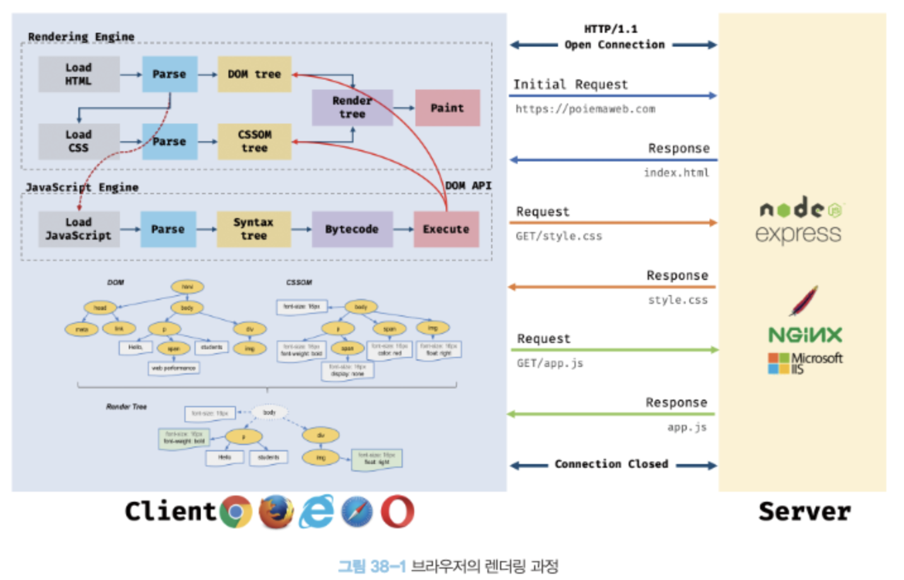
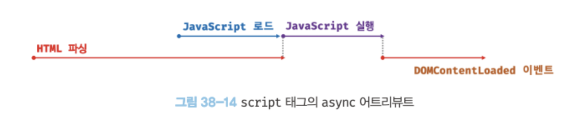
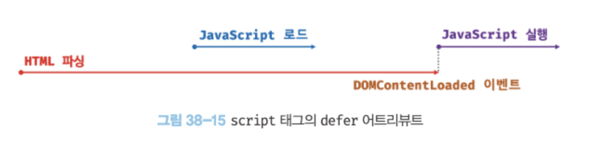

# 38장 브라우저의 렌더링 과정



1. 브라우저는 HTML, CSS, 자바스크립트, 이미지, 폰트 파일 등 렌더링에 필요한 리소스를 요청하고 서버로부터 응답을 받는다.
2. 브라우저의 렌더링 엔진은 서버로부터 응답된 HTML과 CSS를 파싱하여 DOM과 CSSOM을 생성하고 이들을 결합하여 렌더 트리를 생성한다.
3. 브라우저의 자바스크립트 엔진은 서버로부터 응답된 자바스크립트를 파싱하여 AST를 생성하고 바이트코드로 변환하여 실행한다. 이때 자바스크립트는 DOM API를 통해 DOM이나 CSSOM을 변경할 수 있다. 변경된 DOM과 CSSOM은 다기 렌더 트리로 결합된다.
4. 렌더 트리를 기반으로 HTML 요소의 레이아웃(위치와 크기)을 계산하고 브라우저 화면에 HTML 요소를 페인팅한다.

## 38.1 요청과 응답

- 브라우저의 핵심기능: 필요한 리소스(HTML, CSS, 자바스크립트, 이미지, 폰트 등의 정적 파일 또는 서버가 동적으로 생성한 데이터)를 서버에 요청하고 서버로부터 응답받아 브라우저에 시각적으로 렌더링 하는 것. 렌더링에 필요한 리소스는 보두 서버에 존재하므로 필요한 리소스를 서버에 요청하고 서버가 응답한 리소스를 파싱하여 렌더링한다.
- 서버에 요청을 전송하기 위해 브라우저는 주소창을 제공한다.
  - 브라우저의 주소창에 URL을 입력하고 엔터 키를 누르면 URL의 호스트 이름이 DNS를 통해 IP 주소로 변환되고 이 IP주소를 갖는 서버에게 요청을 전송한다.
  - 서버는 루트 요청에 대해 서버의 루트 폴더에 존재하는 정적 파일 index.html을 클라이언트(브라우저)로 응답한다.
  - 다른 정적 파일을 서버에 요청하려면 브라우저의 주소창에 요청할 정적 파일의 경로와 파일 이른을 URL의 호스트 뒤의 패스에 기술하여 서버에 요청한다.
  - 반드시 서버 주소창을 통해 서버에게 정적 파일만을 요청할 수 있는 것은 아니다. 자바스크립트를 통해 동적으로 서버에 정적/동적 데이터를 요청할 수도 있다.
  - 요청과 응답은 개발자 도구의 Network 패널에서 확인할 수 있다.

## 39.2 HTTP 1.1과 HTTP 2.0

HTTP는 웹에서 브라우저와 서버가 통신하기 위한 프로토콜(규약)이다.

**HTTP/1.1과 HTTP/2의 차이**

- HTTP/1.1
  - 기본적으로 커넥션당 하나의 요청과 응답만 처리한다. 즉 여러개의 요청을 한 번에 전송할 수 없고 응답 또한 마찬가지다.
  - 따라서 HTML 문서 내에 포함된 여러 개의 리소스 요청이 개별적으로 전송되고 응답 또한 개별적으로 전송된다.
  - 요청할 리소스의 개수에 비례하여 응답 시간도 증가하는 단점이 있음.
- HTTP/2
  - 커넥션당 여러 개의 요청과 응답, 즉 다중 요청/응답이 가능하다.
  - 리소스의 동시 전송이 가능하므로 HTTP/1.1에 비해 페이지 로드 속도가 약 50% 정도 빠르다고 알려져 있다.

## 38.3 HTML 파싱과 DOM 생성

- 브라우저의 요청에 의해 서버가 응답한 HTML 문서는 문자열로 이루어진 순수한 텍스트다. 순수한 텍스트인 HTML 문서를 브라우저에 시각적인 픽셀로 렌더링하려면 HTML 문서를 브라우저가 이해할 수 있는 자료구조(객체)로 변환하여 메모리에 저장해야 한다.

- 브라우저의 렌더링 엔진이 응답받은 HTML 문서를 파싱하여 브라우저가 이해할 수 있는 자료구조인 DOM을 생성하는 과정
  
  DOM은 HTML 문서를 파싱한 결과물이다.

## 38.4 CSS 파싱과 CSSOM 생성

- 렌더링 엔진은 DOM을 생성해 나가다가 CSS를 로드하는 link 태그나 style 태그를 만나면 생성을 일시 중단한다.
- 그리고 link 태그의 href 어트리뷰트에 지정된 CSS 파일을 서버에 요청하여 로드한 CSS 파일이나 style 태그 내의 CSS를 HTML과 동일한 과정(바이트->문자->토큰->노드->CSSOM)을 거치며 해석하여 CSSOM(CSS Object Model)을 생성한다.
- 이후 CSS 파싱을 완료하면 HTML 파싱이 중단된 지점부터 다시 HTML을 파싱하기 시작하여 DOM 생성을 재개한다.

## 38.5 렌더 트리 생성

- 렌더링 엔진은 서버로부터 응답된 HTML과 CSS를 파싱하여 각각 DOM과 CSSOM를 생성한다. 그리고 DOM과 CSSOM은 렌더링을 위해 렌더 트리로 결합된다.
- 렌더 트리:
  - 렌더링을 위한 트리 구조의 자료구조
  - 브라우저 화면에 렌더링되지 않는 노드와 CSS에 의해 비표시되는 노드들은 포함하지 않는다.
- 이후 완성된 렌더 트리는 각 HTML 요소의 레이아웃을 계산하는 데 사용되며 브라우저 화면에 픽셀을 렌더링하는 페인팅처리에 입력된다.

- 레이아웃 계산과 페인팅을 다시 실행하는 리렌더링은 비용이 많이 드는, 즉 성능에 악영향을 주는 작업이다. 따라서 가급적 리렌더링이 빈번하게 발생하지 않도록 주의할 필요가 있다.

## 38.6 자바스크립트 파싱과 실행

- 자바스크립트 파싱과 실행은 브라우저의 렌더링 엔진이 아닌 자바스크립트 엔진이 처리한다.
- 자바스크립트 엔진은 자바스크립트 코드를 파싱하여 CPU가 이해할 수 있는 저수준 언어로 변환하고 실행하는 역할을 한다.
- 렌더링 엔진으로부터 제어권을 넘겨받은 자바스크립트 엔진은 자바스크립트 코드를 파싱하기 시작한다.
- 자바스크립트 엔진은 자바스크립트를 해석하여 AST를 생성한다.
- 그리고 AST를 기반으로 인터프리터가 실행할 수 있는 중간 코드인 바이트코드를 생성하여 실행한다.

## 38.7 리플로우와 리페인트

만약 자바스크립트 코드에 DOM이나 CSSOM을 변경하는 DOM API가 사용된 경우 DOM이나 CSSOM이 변경된다. 이때 변경된 DOM과 CSSOM은 다시 렌더 트리로 결합되고 변경된 렌더 트리를 기반으로 레이아웃과 페인트 과정을 거쳐 브라우저의 화면에 다시 렌더링한다. 이를 리플로우, 리페인트라 한다.

- 리플로우: 레이아웃 계산을 다시 하는 것을 말하며, 노두 추가/삭제, 요소의 크기/위치 변경, 윈도우 리사이징 등 레이아웃에 영향을 주는 변경이 발생한 경우에 한하여 실행된다.
- 리페인트: 재결합된 렌더 트리를 기반으로 다시 페인트를 하는 것

리플로우와 리페인트가 반드시 순차적으로 동시에 실행되는 것은 아니다. 레이아웃에 영향이 없는 변경은 리플로우 없이 리페인트만 실행된다.

## 38.8 자바스크립트 파싱에 의한 HTML 파싱 중단

- 렌더링 엔진과 자바스크립트 엔진은 병렬젹으로 파싱을 실행하지 않고 직렬적으로 파싱을 수행한다.
- 브라우저느 동기적으로, 즉 위에서 아래 방향으로 순차적으로 HTML, CSS, 자바스크립트를 파싱하고 실행한다. 이것은 script 태그의 위치에 따라 HTML 파싱이 블로킬되어 DOM 생생이 지연될 수 있다는 것을 의미한다. 따라서 script 태그의 위치는 중요한 의미를 갖는다.

## 38.9 script 태그의 async/defer 어트리뷰트

자바스크립트 파싱에 의한 DOM 생성이 중단되는 문제를 근본적으로 해결하기 위해 HTML5부터 script 태그에 async와 defer 어트리뷰트가 추가되었다.

async와 defer 어트리뷰트는 다음과 같이 src 어트리뷰트를 통해 외부 자바스크립트 파일을 로드하는 경우에만 사용할 수 있다. 즉, src어트리뷰트가 없는 자바스크립트에는 사용할 수 없다.

```js
<script async src = "extern.js"></script>
<script defer src = "extern.js"></script>
```

async와 defer 어트리뷰트를 사용하면 HTML 파싱과 외부 자바스크립트 파일의 로드가 비동기적으로 동시에 진행된다. 하지만 자바스크립트의 실행 시점에 차이가 있다.

- **async 어트리뷰트:** 자바스크립트 파일의 로드가 완료된 직후 진행되며, 이때 HTML 파싱이 중단된다.
  
- **defer 어트리뷰트:** HTML 파싱이 완료된 직후, 즉 DOM 생성이 완료된 직후 진행된다.
  
