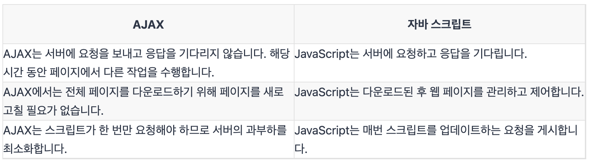

# 43장. Ajax

## 면접 예상 질문

1. Ajax란 무엇이며 왜 사용하는가?
   - Ajax는 JavaScript의 라이브러리중 하나이며 Asynchronous Javascript And Xml(비동기식 자바스크립트와 xml)의 약자이다. 전체 페이지를 새로고침 하지 않고도 페이지의 일부만을 위한 데이터를 로드하는 기법 이며 Ajax를 한마디로 정의하자면 JavaScript를 사용한 비동기 통신, 클라이언트와 서버간에 XML 데이터를 주고받는 기술이라고 할 수 있다. 화면의 내용을 갱신하기 위해서는 request 와 response를 하면서 페이지 전체를 갱신하게 된다. 하지만 이렇게 할 경우 페이지의 일부분만 갱신할 경우에도 페이지 전체를 다시 로드해야하는데 엄청난 자원낭비와 시간낭비를 초래한다. ajax는 html 페이지 전체가 아닌 일부분만 갱신할수 있도록 해준다. 이 경우 Json이나 xml형태로 필요한 데이터만 받아 갱신하기 때문에 그만큼의 자원과 시간을 아낄 수 있다.
2. Ajax의 단점은 무엇이 있나요?

   - AjAX는 Javascript에 의존한다. 브라우저나 시스템에 Javascript 문제가 있는 경우 OS, Ajax는 지원하지 않는다.
   - Ajax는 대부분 Javascript를 사용하므로 검색 엔진에서 문제가 될 수 있다. Ajax로 작성된 소스 코드는 사람이 쉽게 읽을 수 있어 몇 가지 보안 문제가 존재한다.
   - 디버깅이 어렵다
   - 요청 크기 증가
   - 느리고 불안정한 네트워크 연결

3. 도메인간 Ajax 호출에 사용되는 두 가지 방법은 무엇입니까?

   - CORS – Cross Origin Resource Sharing이며 HTTP 웹 브라우저와 작동한다.
   - JSONP – JSON HTTP GET 및 레거시 브라우저에서 작동하는 Padding 사용.

4. Ajax와 Javascript의 차이점
   
