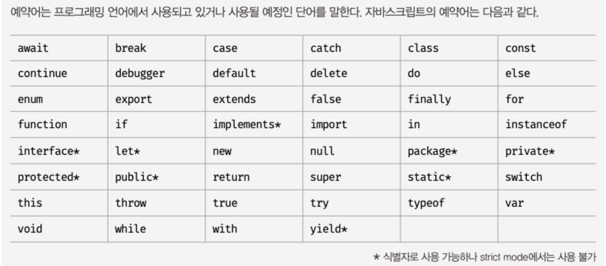

# 04장. 변수(variable)

## 4.1 변수란 무엇인가? 왜 필요한가?

하나의 값을 저장하기 위해 확보한 메모리 공간 자체 또는 그 메모리 공간을 식별하기 위해 붙인 이름.
값을 저장하고 참조하는 메커니즘으로, 값의 위치를 가리키는 강징적인 이름이다.

- 변수 이름(변수명) : 메모리 공간에 저장된 값을 식별할 수 있는 고유한 이름
- 변수 값 : 변수에 저장된 값
- 할당assignment(대입, 저장): 변수에 값을 저장하는 것
- 참조reference: 변수에 저장된 값을 읽어 들이는 것

## 4.2 식별자 identifier

- 변수의 이름을 식별자라고 한다.
- 어떤 값을 구별해서 식별할 수 있는 고유한 이름을 말한다.
- 값이 아니라 메모리 주소를 기억한다.
- 변수, 함수, 클래스 등의 이름과 같은 식별자는 네이밍 규칙을 준수해야 하며, 선언(declaration)에 의해 자바스크립트 엔진에 시별자의 존재를 알린다.

## 4.3변수 선언 variable declaration

변수 선언이란 변수를 생성하는 것을 말한다. 값을 저장하기 위한 메모리 공간을 확보하고 변수 이름과 확보된 메모리 공간의 주소를 연결해서 사뵤을 저장할 수 있게 준비하는 것이다.

**변수를 사용하려면 반드시 선언이 필요하다. var, let, const 키워드를 사용한다.**

- var
  - **단점:** 블록 레벨 스코프를 지원하지 않고 함수 레벨 스코프를 지원한다. 의도치 않게 전역 젼수가 선언되어 심각한 부작용이 발생할 수 있다.
  - ES6에서 var 키워드의 여러 단점을 보완하기 위해 ler, const 도입.
  - 변수 선언 단계
    - 선언 단계: 뱐수 이름 등록해서 자바스크립트 엔진에 변수의 존재를 알린다.
    - 초기화 단계: 값을 저장하기 위한 메모리 공간을 확보하고 암묵적으로 undefined를 할당해 초기화한다.
      ```js
      var score; //변수 선언
      ```
      위와 같이 변수를 선언한 후 변수의 값을 할당하지 않으면 undefined라는 값이 **암묵적으로 할당되어 초기화 된다.**
    - 초기화: 변수가 선언된 이후 최초로 값을 할당하는 것.

## 4.4 변수 선언의 실행 시점과 변수 호이스팅

```js
console.log(score); //undefined
var score; //변수 선언
```

- 자바스크립트 엔진은 변수 선언이 소스코드의 어디에 있든 상관 없이 다른 코드보다 먼저 실행한다. 따라서 변수 선언이 소스코드의 어디에 으치하는지와 상관없이 어디서든지 변수를 참조할 수 있다.
- 위 코드와 같이 변수를 참조하는 코드가 변수를 선언하기 전에 작성되어 있지만 참조 에러(ReferenceError)가 아닌 undefined가 출력된다.
  이처럼 변수 선언문이 코드의 선두로 끌어 올려진 것처럼 동작하는 자바스크립트 고유의 특징을 **변수 호이스팅**이라 한다.
- 변수 선언뿐 아니라 키워드를 사용해서 선언하는 모든 식별자(변수, 함수, 클래스 등)는 호이스팅 된다. 모든 선언문은 런타임 이전 단계에서 먼저 실행되기 때문이다.

## 4.5 값의 할당

변수에 값을 할당 할 때는 할당 연산자 =를 사용한다.

```js
var score;
score = 80;
```

또는 아래와 같이 하나의 문으로 단축 표현

```js
var score = 80;
```

- **변수 선언은 소스코드가 순차적으로 실행되는 런타임 이전에 먼저 실행되지만 값의 할당은 런타임에 실행된다.
  **

## 4.6 값의 재할당

이미 값이 할당되어 있는 변수에 새로운 값을 또다시 할당하는 것.

```js
var score = 80; //변수 선언과 값의 할당
score = 90; //재할당
```

- var,let 키워드로 선언한 변수는 재할당이 가능하다.
- const 키워드로 선언한 변수는 상수이기 때문에 재할당이 불가능하다.

## 4.7 식별자 네이밍 규칙

- 식별자는 특수문자를 제외한 문자, 숫자, \_, $를 포함 할 수 있다.
- 단 숫자로 시작하는 것은 허용되지 않는다.
- 예약어는 식별자로 사용할 수 없다.  
  
