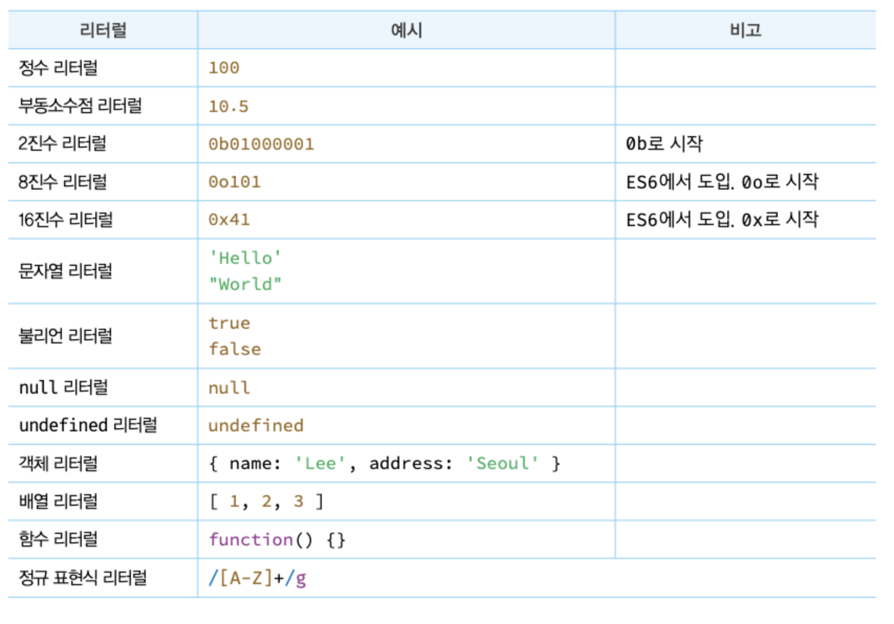
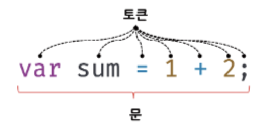

# 05장. 표현식과 문

## 5.1 값 value

식(표현식expression)이 평가되어 생성된 결과. 평가란 식을 해석해서 값을 생성하거나 참조하는 것을 의미한다.

```js
//변수에 10+20이 평가되어 생성된 숫자 값 30이 할당된다.
var sum = 10 + 20; //30
```

- 모든 값은 데이터 타입을 가진다.
- 메모리에 2진수, 즉 비트bit의 나열로 저장된다.
- 변수에 할당되는 것은 값이다.
- 값은 위 코드처럼 식으로 생성할 수 있지만 가장 기본적인 방법은 리터럴을 사용하는 것이다.

## 5.2 리터럴 literal

사람이 이해할 수 있는 문자 또는 약속된 기호를 사용해 값을 생성하는 표기법.


## 5.3 표현식 expression

표현식은 값으로 평가될 수 있는 문(statement)이다. 즉, 표현식이 평가되면 새로운 값을 생성하거나 기존 값을 참조한다.

표현식 예시

- ```js
  var score = 100;
  ```
  100은 리터럴이다. 리터럴 100은 자바스크립트 엔진에 의해 평가되어 값을 생성하므로 리터럴 그 ㅏㅈ체로 표현식이다.
- ```js
  var score = 50 + 50;
  ```
  50+50은 리터럴과 연산자로 이루어져 있지만 50+50이 평가되어 값100을 생성하므로 표현식이다.
  ```js
  score; //100
  ```
  변수 식별자의 참조면 변수 값으로 평가되어 표현식이다.

## 5.4 문 statement

- 문은 프로그램을 구성하는 기본 단위이자 최소 실행 단위다.

  - 프로그램: 문의 집합
  - 프로그래밍: 문을 작성하고 순서에 맞게 나열하는 것

- 문은 여러개의 토큰으로 구성된다.

  - 토큰token: 문법적인 의미르 가지며, 문법적으로 더 이상 나눌 수 없는 코드의 기본 요소를 의미한다.
    

- **명령문**이라고도 부른다.
  - 컴퓨터에 내리는 명령.
  - 문이 실행되면 명령이 실행되고 무슨 일인가가 일어나게 된다.
- 문의 종류

  ```js
  //변수 선언문
  var x;

  //할당문
  x = 5;

  //함수 선언문
  function foo() {}

  //조건문
  if (x > 1) {
    console.log(x);
  }

  //반복문
  for (var i = 0; i < 2; i++) {
    console.log(i);
  }
  ```

## 5.5 세미콜론과 세미콜론 자동 삽입 기능

- 세미콜론(;)은 문의 종료를 나타낸다.
- 문에 끝에 붙이는 세미콜론은 옵션이다. 즉 생략이 가능하다.
