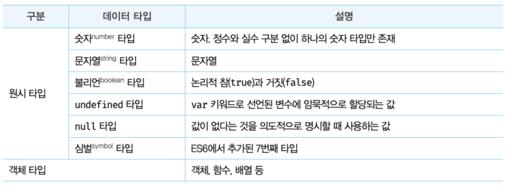
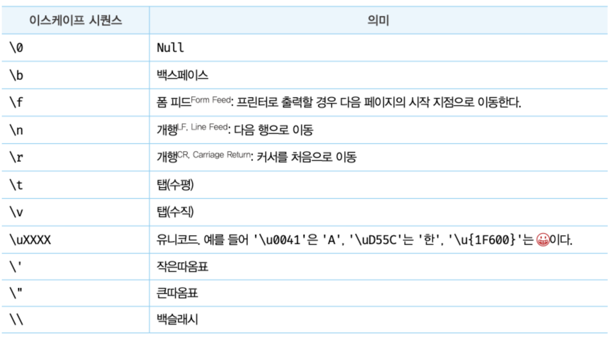

# 06장. 데이터 타입 data type

데이터 타입(줄여서 '타입')은 값의 종류를 말한다. 자바스크립트의 모든 값은 데이터 타입을 갖는다.

### **자바스크립트(ES6) 7개의 데이터 타입**



## 6.1 숫자 타입

- C나 자바와 다르게 자바스크립트는 하나의 숫자 타입만 존재한다.
- 모든 수를 실수로 처리하며, 정수만 표현하기 위한 데이터 타입이 별도로 존재하지 않는다.
- 추가적으로 세 가지 특별한 값 표현 가능
  - Infinity: 양의 무한대
  - -Infinity: 음의 무한대
  - NaN: 산술 연산 불가(not-a-number)
  ```js
  console.log(10 / 0); //Infinity
  console.log(10 / -0); //-infinity
  console.log(1 * "String"); //NaN
  ```
  자바스크립트는 대소문자를 구별하므로 NaN의 대소문자를 정확히 해줘야 한다.
  ```js
  var x = nan; //ReferenceError: nan is not defined
  ```

## 6.2 문자열 타입

- 텍스트 데이터를 나타내는 데 사용
- 0개 이상의 16비트 유니코드 문자(UTF-16)의 집합
- 전 세계 대부분의 문자 표현 가능
- 표기법
  ```js
  var string;
  string = "문자열"; // 작은 따옴표
  stirng = "문자열"; // 큰 따옴표
  string = `문자열`; // 백틱(ES6 템플릿 리터럴)
  ```

## 6.3 템플릿 리터럴 template literal

- ES6부터 도입된 새로운 문자열 표기법
- 멀티라인 문자열, 표현식 삽입, 태그드 템플릿 등 편리한 문자열 처리 기능 제공

  ```js
  var template = `Template literal`;
  console.log(template); //Template literal
  ```

  ### 6.3.1 멀티라인 문자열

  - 일반 문자열 내에서는 줄바꿈이(개행)이 허용되지 않는다.
  - 줄바꿈 등의 공백을 표현하려면 백슬래시(\)로 시작하는 이스케이프 시퀀스를 사용해야 한다.
    
  - 템플릿 리터럴 내에서는 이스케이프 시쿼스를 사용하지 않고도 줄바꿈이 허용되며, 모든 공백도 그대로 적용된다.

  ### 6.3.2 표현식 삽입

  - +를 사용해 문자열 연결.

    ```js
    var first = "Jinyoung";
    var last = "Baek";

    console.log("my name is " + first + " " + last + "."); // My name is JInyoung baek.
    ```

  - 템플릿 리터럴 내에서 표현식 삽입

    ```js
    var first = "Jinyoung";
    var last = "Baek";

    console.log(`my name is ${first} ${last}.`); // My name is JInyoung baek.
    ```

    - 이때 표현식이 아니더라도 문자열로 타입이 강제로 변환되어 삽입된다.
    - 표현식 삽입은 반드시 템플릿 리터럴 내에서 사용해야 한다.
    - 일반 문자열에서는 문자열로 취급된다.

## 6.4 불리언 타입

- 불리언 타입의 값은 논리적 참, 거짓을 나태내는 true와 false뿐이다.
- 참과 거짓으로 구분되는 조건에 의해 프로그램의 흐름을 제어하는 조건문에서 자주 사용한다.

## 6.5 undefined 타입

- undefined의 값은 undefined가 유일하다.
- 변수를 선언한 후 값을 할당하지 않은 변수를 참조하면 undefined가 반환된다.
  ```js
  var foo;
  console.log(foo); // undefined
  ```
- undefined는 개발자가 의도적으로 할당하기 위한 값이 아닌, 자바스크립트 엔진이 변수를 초기화할 때 사용하는 값이다.
- **의도적으로 변수에 값이 없다는 것을 명시하고 싶은 때는 null을 할당한다.**

## 6.6 null 타입

- nul타입의 값은 null이 유일하다.
- 대소문자 정확히 해야 함.
- 변수 값이 옶다는 것을 의도적으로 명시할 떄 사용.
- 변수가 이전에 참조하던 값을 더 이상 참조하지 않겠다는 의미.(할당되어 있던 값에 대한 참조를 명시적으로 제거하는 것)
- 함수가 유효한 값을 반환할 수 없는 경우에도 명시적으로 null을 반환 한다.

## 6.7 심벌 타입

- ES6에서 추가된 7번째 타입
- 변경 불가능한 원시타입의 값
- 다른 값과 중복되지 않는 유일무이한 값
- 주로 이름이 충돌할 위험이 없는 객체의 유일한 프로퍼티 키를 만들기 위해 사용한다.
- Symbol 함수를 호출해 생성한다. 이때 생성된 값은 외부에 노출되지 않으며, 다른 값과 중복되지 않는다.

```js
//심벌 값 생성
var key = Symbol("key");
console.log(typeof key); //symbol

//객체 생성
var obj = {};

//이름이 충돌할 위험이 없는 유일무이한 값인 심벌 프로퍼티 키로 사용한다.
obj[key] = "value";
console.log(obj[key]); //value
```

## 6.8 객체 타입

- 크게 원시 타입과 객체 타입으로 분류한다.
- 자바스크립트를 이루고 있는 거의 모든 것이 객체이다.
- 11장에서 자세히

## 6.9 데이터 타입의 필요성

데이터 타입은 값의 종류이다. 자바스크립트의 모든 값은 데이터 타입을 갖는다. 따라서 데이터 타입이 필요한 이유는 다음과 같다.

- 값을 저장할 떄 확보해야 하는 **메모리 공간의 크기**를 결정하기 위해
- 값을 참조할 때 한 번에 읽어 들여야 할 **메모리 공간의 크기**를 결정하기 위해
- 메모리에서 읽어 들인 **2진수를 어떻게 해석할지** 결정하기 위해

## 6.10 동적 타이핑

### 6.10.1 동적 타입 언어와 정적 타입 언어

- **정적 타입 언어**

  - 변수를 선언할 때 변수에 할당할 수 있는 값의 종류, 즉 데이터 타입을 사전에 선언해야 한다.
  - 변수의 타입을 변경할 수 없으며, 변수에 선언한 타입에 맞는 값만 할당할 수 있다.
  - 컴파일 시점에 타입 체크를 하기 때문에 타입의 일관성을 강제함으로써 런타임에 발생하는 에러를 줄인다.
  - 대표적인 정적 타입 언어: C, C++, 자바, 코틀린, 고, 하스켈, 러스트, 스칼라 등

  ```c
  char c;

  int num;
  ```

- **동적 타입 언어**
  - 자바스크립트
  - 변수를 선언할 때 타입을 선언하지 않는다. 할당에 의해 타입이 결정된다.
  - 재할당에 의해 변수의 타입은 언제든지 동적으로 변할 수 있다.
  - var, let, const키워드를 사용해 변수를 선언한다.
  - 어떠한 데이터 타입의 값이라도 자유롭게 할당 가능.
  - typeof연산자로 변수의 데이터 타입을 조소할 수 있다.
  - 대적인 동적 타입 언어: 자바스크립트, 파이썬, PHP, 루비, 펄 등

### 6.10.2 동적 타입 언어와 변수

동적타입 언어는 유연성은 높지만 신뢰성은 떨어진다.

- 동적 타입 언어의 장점:
  변수에 어떤 데이터 타입의 값이라도 자유롭게 할당할 수 있어서 편리함.
- 동적 타입 언어의 구조적인 단점
  - 변수 값이 언제든지 변할 수 있기 때문에 복잡한 프로그램에서는 변화하는 변수 값을 추적하기가 어려움.
  - 값의 변경에 의해 변수의 타입 또한 변경될 수 있다.
  - 자바스크립트는 개발자의 의도와 상관없이 자바스크립트 엔진에 의해 암묵적으로 타입이 자동으로 변환되기도 한다.
- **따라서 변수 사용시 주의할 사항들이 있다.**
  - 꼭 필요한 경우에 한해 제한적으로 사용한다. 변수의 개수가 많을수록 오류가 발생할 확률이 높다.
  - 변수의 유효 범위(스코프)는 최대한 좁게 만든다.
  - 전역 변수는 최대한 사용하지 않는다.
  - 변수보다는 상수를 사용해 값의 변경을 억제한다.
  - 변수 이름은 변수의 목적이나 의미를 파악할 수 있도록 네이밍한다.
