# 07장. 연산자 operator

연산자는 하나 이상의 표현식을 대상으로 산술, 할당, 비교, 논리, 타입, 지수 연산 등을 수행해 하나의 값을 만든다. 이때 연산의 대상을 피연산자라고 한다.

## 7.1 산술 연산자 arithmetic operator

- 피연산자를 대상으로 수학적 계산을 수행해 새로운 숫자의 값을 만든다.
- 산술 연산이 불가능한 경우 NaN을 반환한다.
- 피연산자의 개수에 따라 **이항 산술 연산자**와 **단항 산술 연산자**로 구분.

  ### 7.1.1 이항 산술 연산자

  - 2개의 피연산자를 산술하여 숫자 값을 만든다.
    ```js
    5 + 2; // 7
    5 - 2; // 3
    ```
  - 어떤 산술 연산을 해도 피연산자의 값이 바뀌는 경우는 없고 **언제나 새로운 값을 만들 뿐이다.**(부수 효과 X)
    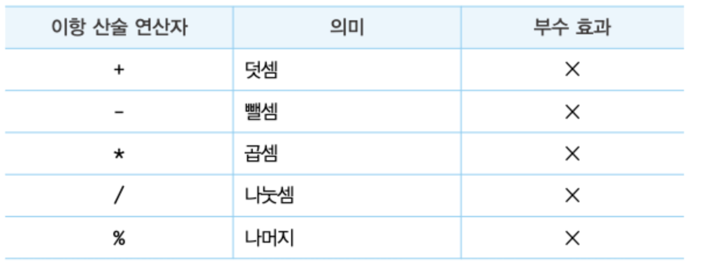

  ### 7.1.2 단항 산술 연산자

  - 1개의 피연산자를 산술하여 숫자 값을 만든다.
    
  - 주의할 점:

    - 증가/감소(++/--)연산자는 피연산자의 값을 변경하는 부수 효과가 있다.
    - 피연산자의 값을 변경하는 암묵적 할당이 이뤄진다.
      ```js
      var x = 1;
      x++; //x = x+1
      console.log(x); //1
      ```
    - 증간/간소(++/--)연산자는 위치에 의미가 있다

      ```js
      var x = 5,
        result;

      //선할당 후증가
      result = x++;
      console.log(result, x); //5 6

      //선증가 후할당
      result = ++x;
      console.log(result, x); // 7 7
      ```

    - +단항 연산자는 어떠한 효과도 없다. 은수를 얀수로 반전하지도 않는다.

      ```
      +10; //10
      +(-10); //10
      ```

      숫자 타입이 아닌 피연산자에 + 단항 연산자를 사용하면 피연산자를 숫자 타입으로 변환하여 반환한다. 피연산자를 변경하는 것이 아닌 변환한 값을 생성해서 반환하기 때문에 부수효과 X.

      ```js
      var x = "1";
      console.log(+x); // 1
      console.log(x); // '1'

      x = "hello";
      console.log(+x); // NaN (숫자로 타입 변환이 불가한 경우 NaN반환)
      ```

    - -단항 연산자는 피연산자의 부호를 반전한 값을 반환한다. 부수 효과 X
      ```js
      -(-10); // 10
      -"10"; //-10
      -true; //-1
      -"hello"; //NaN
      ```

  ### 7.1.3 문자열 연결 연산자

  +연산자는 피연사자 중 하나 이상이 문자열인 경우 문자열 연결 연산자로 동작한다.

  ```js
  "1" + 2; //'12'
  1 + true; // 2 (true는 1로 타입 변환)
  1 + false; // 1 (false는 0으로 타입 변환)
  1 + null; // 1 (null은 0으로 타입 변환)

  +undefined; // NaN (undefined는 숫자로 타입 변환되지 않는다)
  ```

## 7.2 할당 연산자 assignment operator

우항에 있는 피연산자의 평가 결과를 좌한에 있는 변수에 할당. 부수 효과 O.
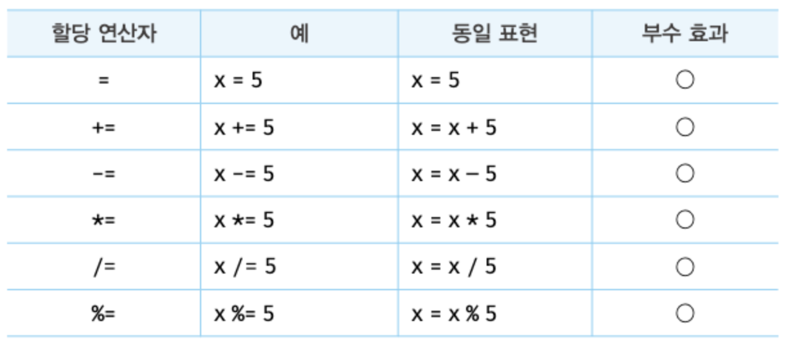

- 할당문은 값으로 평가되는 표현식인 문으로서 할당된 값으로 평가된다.
- 여러 변수에 동일한 값을 연쇄 할당할 수 있다.

  ```js
  var a, b, c;

  a = b = c = 0;

  console.log(a, b, c); // 0 0 0
  ```

## 7.3 비교 연산자 comparison operator

- 좌항과 우항의 피연산자를 비교한 다음 그 결과를 불리언 값으로 반환한다.
- if문이나 for문과 같은 제어문의 조건식에서 주로 사용한다.

  ### 7.3.1 동등/일치 비교 연산자

  좌항과 우항의 피연산자가 같은 값으로 평가되는지 비교해 줄리언 값을 반환한다.
  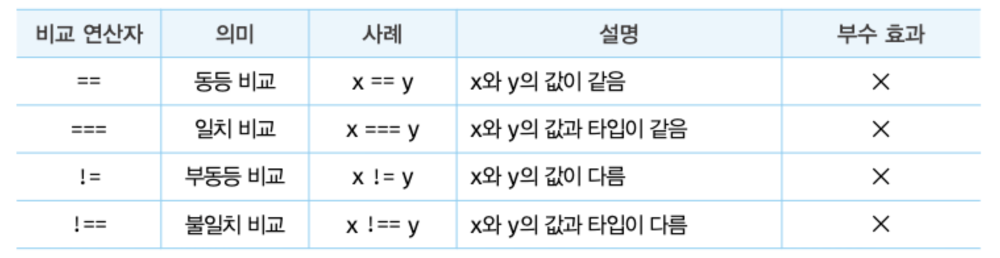

  - **동등 비교 ==**

    - 느슨한 비교
    - 암묵적 타입 변환을 통해 타입을 일치시킨 후 같은 값인지 비교
    - 결과를 예측하기 어렵고 실수하기 쉽다. 사용하지 않는 편이 좋다.

      ```js
      5 == 5; // true

      //타입은 다르지만 암묵적 타입 변환을 통해 타입을 일치시키면 동등하다
      5 == "5"; // true
      ```

  - 일치 비교 ===

    - 엄격한 비교
    - 타입도 같고 값도 같은 경우에 한하여 true를 반환한다.
      ```js
      5 === 5; // true
      5 === "5"; //false
      ```
    - 주의할 점: NaN, 0

      ```js
      NaN === NaN; // false (NaN은 자신과 일치하지 않는 유일한 값이다)

      // 숫자가 NaN인지 조사하여면
      Number.isNaN(NaN); // true
      Number.isNaN(10); // false
      Number.isNaN(1 + undefined); // true

      //양의 0과 음의 0ㅇㅇㅇㅇ의 비교
      0 === -0; // true
      0 == -0; //true
      ```

    - Object.is 메서드

      - ES6에서 도입됨
      - 다음과 같이 예측 가능한 정확한 비교 결과 반환. 그 외에는 일치 비교 연산자와 동일.

      ```js
      -0 === +0; // true
      Object.is(-0, +0); // false

      NaN === NaN; // false
      Object.is(NaN, NaN); // true
      ```

    - 부동등 비교 연산자(!=)와 불일치 비교 연산자(!==)는 각각 동등 비교 연산자와 일치 비교 연산자와 반대 개념.

  ### 7.3.2 대소 관계 비교 연산자

  피연산자의 크기를 비교하여 불리언 값 반환.
  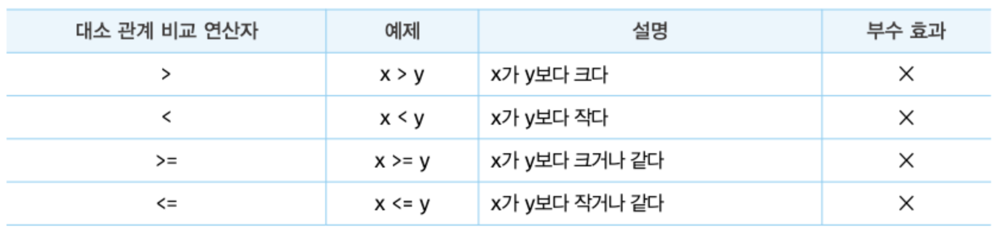

## 7.4 삼항 조건 연산자 ternary operator

- 조건식의 평가 결과에 따라 반환할 값을 결정한다.
- 자바스크립드의 유일한 삼항 연산자
- 부수 효과 X
  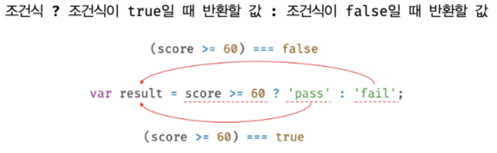
- if...else문과의 차이
  - if...else문은 표현식이 아닌 문이다. 값처럼 사용할 수 없음
  - 삼항 조건 연산자 표현식은 값으로 평가할 수 있는 표현식인 문이다.
  - 조건에 따라 어떤 값을 결정해야 한다면 삼항 조건 연산자가 표현식을 사용하는 편이 유리하지만, 수행해야 할 문이 하나가 아니라면 if...else문의 가독성이 더 좋다.

## 7.5 논리 연산자 logical operator

우항과 좌항의 피연산자(주정 논리 연산자의 경우 우항의 피연산자)를 논리 연산 한다.
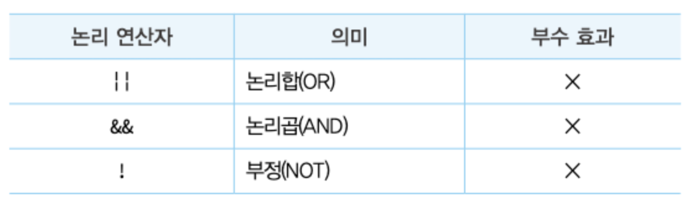

```js
true || true; // true
true || false; // true
false || true; // true
false || false; // false

true && true; //true
true && false; //false
false && true; //false
false && false; //false

!true; //false
!false; // true
```

- 논리 부정(!) 연산자는 언제나 불리언 값을 반환한다. 피연산자가 불리언 값이 아니면 불리언 타입으로 암묵적 타입 변환된다.
  ```js
  !0; //true
  !"hello"; //false
  ```
- 논리합(||) 또는 논리곱(&&) 연산자 표현식의 평가 결과는 불리언 값이 아닐 수도 있다. 언제나 2개의 피연산자 중 어느 한쪽으로 평가된다.
  ```js
  "Cat" && "Dog"; // Dog
  ```

## 7.6 쉽표 연산자

왼쪽 피연산자 부터 차례대로 피연산자를 평가하고 마지맞 피연산자의 평가가 끝나면 마지막 피연산자의 평가 결과를 반환한다.

```
var x,y,z;

x=1,y=2,z=3 // 3
```

## 7.7 그룹 연산자

- 자신의 피연산자인 표현식을 가장 먼저 평가 한다. 우선순위가 가장 높음.
  ```js
  10 * 2 + 3; //23
  10 * (2 + 3); //50
  ```

## 7.8 typeod 연산자

- 피연산자의 데이터 문자열로 반환.
- 7가지 문자열 "string", "number", "boolean", "undefined", "symbol", "object", "function" 중 하나 반환
- typeof연산자가 반환하는 문자열은 7개의 데이터 타입과 정확히 일치하지는 않는다.
  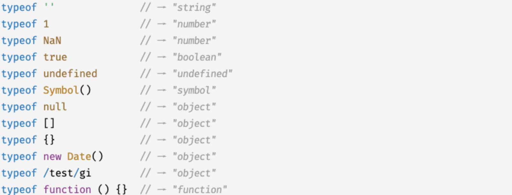
- 주의할 점:

  - null 값을 연산하면 "null"이 아닌 "object"를 반환한다. (자바스크립트의 첫 번째 버전의 버그, 아직 수정되지 못하고 있음)
  - 따라서 값이 null타입인지 확인할 때는 일치 연산자(===)를 사용해야 한다.

    ```js
    var foo = null;

    typeof foo === null; // false
    foo === null; // true
    ```

  - 선언하지 않은 식별자를 typeof 연산자로 연산해 보면 ReferenceError가 발생하지 않고 undefined를 반환한다.

## 7.9 지수 연산자

- ES7에서 도입된 거듭 제곱 연산
  ```js
  2 ** 2; // 4
  2 ** 0; //1
  2 ** -2; //0.25
  ```
- 지수 연산자가 도입되기 전에는 Math.pow메서드를 사용했다.
  ```js
  Math.pow(2, 2); // 4
  Math.pow(2, 0); // 1
  ```
- 다음과 같은 경우 지수 연산자가 가독성이 더 좋다.
  ```js
  2 ** (3 ** 2); // 512
  Math.pow(2, Math.pow(3, 2));
  ```
- 음수를 거듭제곱의 밑으로 사용할 때는 괄호로 묶어야 한다.
  ```js
  -5**2;// SyntaxError
  (-5)**2// 25
  ```
- 할당 연산자와 함께 사용 가능
  ```js
  var num = 5;
  num **= 2; //25
  ```
- 이항 연산자 중에 우선순위가 가장 높음
  ```js
  2 * 5 ** 2; // 50
  ```

## 7.10 그 외의 연산자

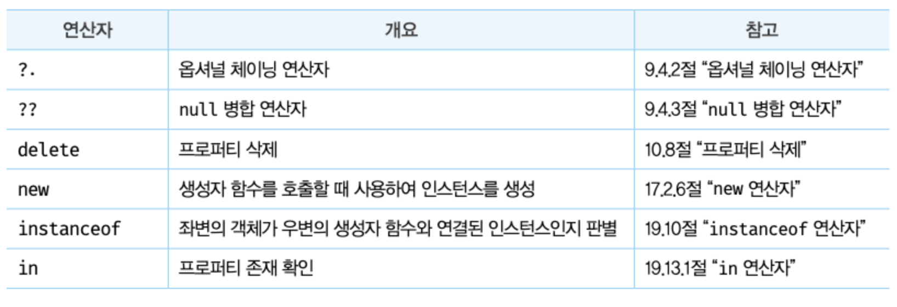

## 7.11 연산자의 부수 효과

대부분의 연산자는 다른 코드에 영향을 주지 않는다

- 부수 효과가 있는 연산자: 할당 연산자(=), 증가/감소 연선자(++/--), delete 연산자.

  ```js
  var o = { a: 1 };

  delete o.a; // 객체의 프로퍼티를 삭제하는 부수효과가 있음
  console.log(o); // {}
  ```

## 7.12 연산자 우선순위

- 우선순위가 높을수록 먼저 실행된다.
- 모두 기억하기 어렵고 실수하기 쉽기 때문에 그룹 연산자()를 사룔하여 우선순위를 명시적으로 조절하는 것을 권장.
  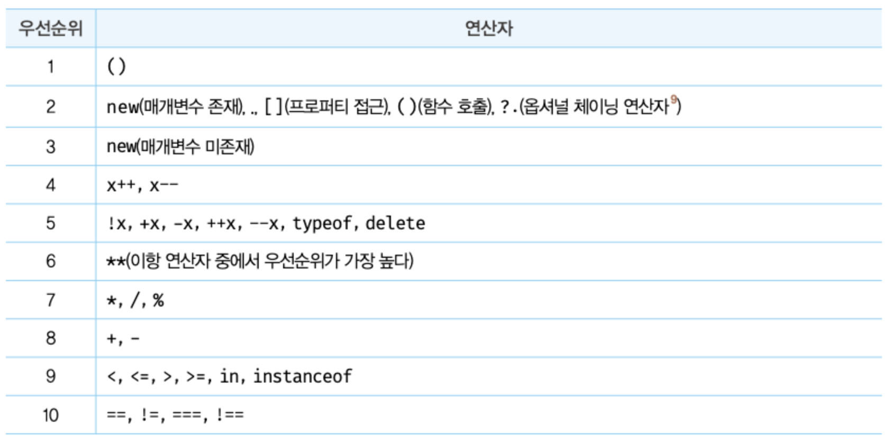
  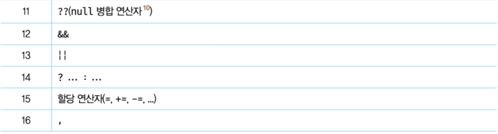

## 7.13 연산자의 결합 순서

연산자의 어느쪽(좌항 또는 우항)부터 평가를 수행할 것인지를 나타내는 순서
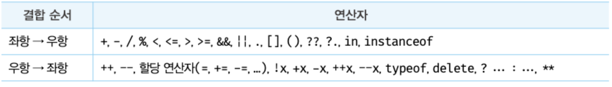
