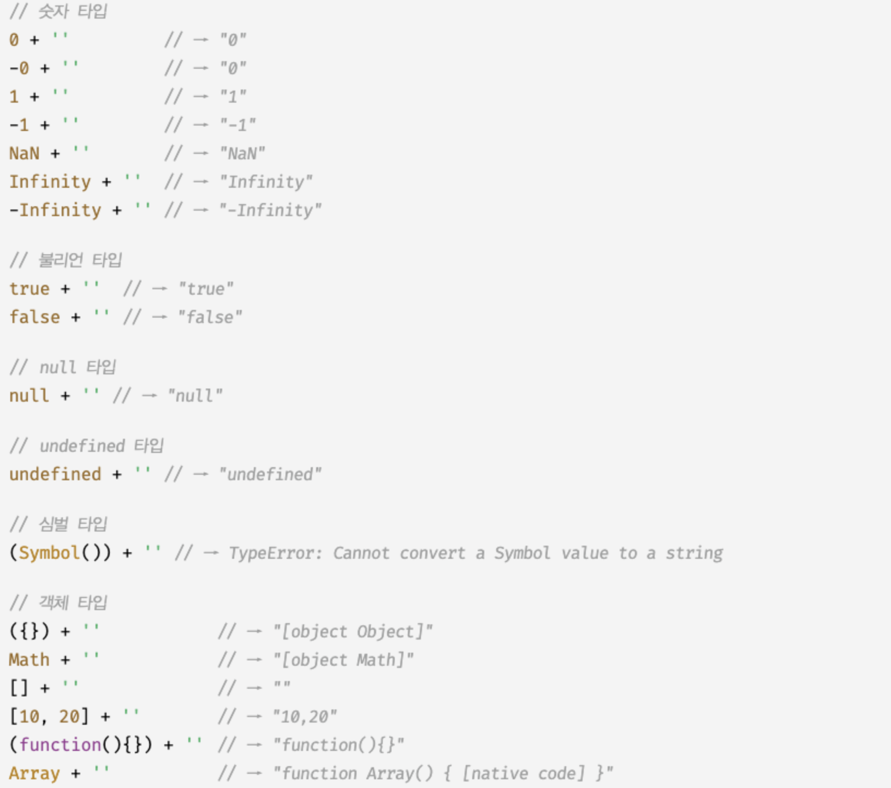
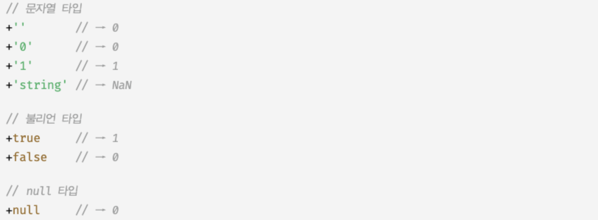
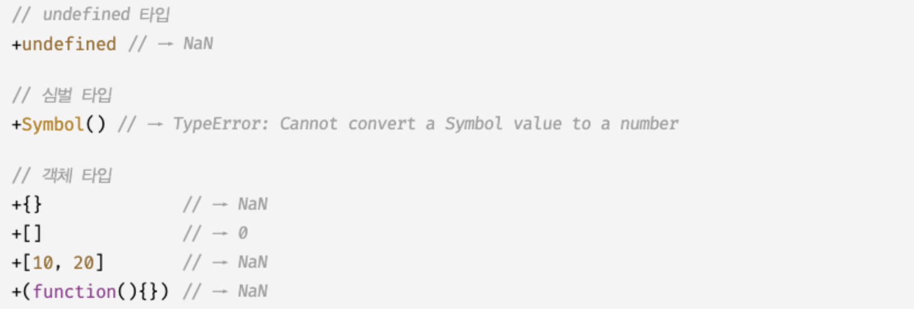
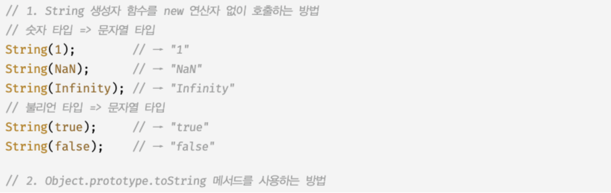
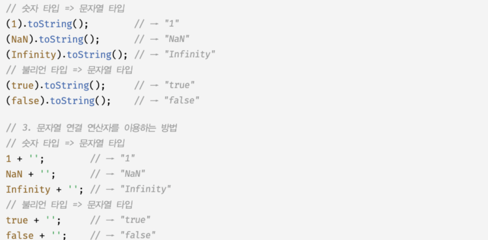
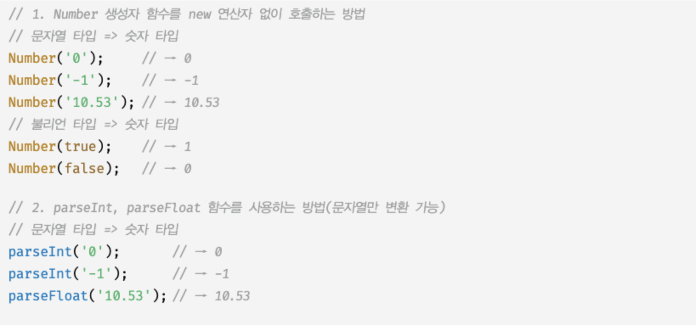
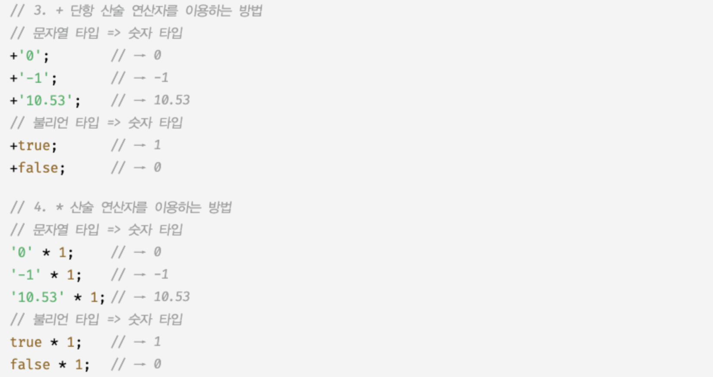
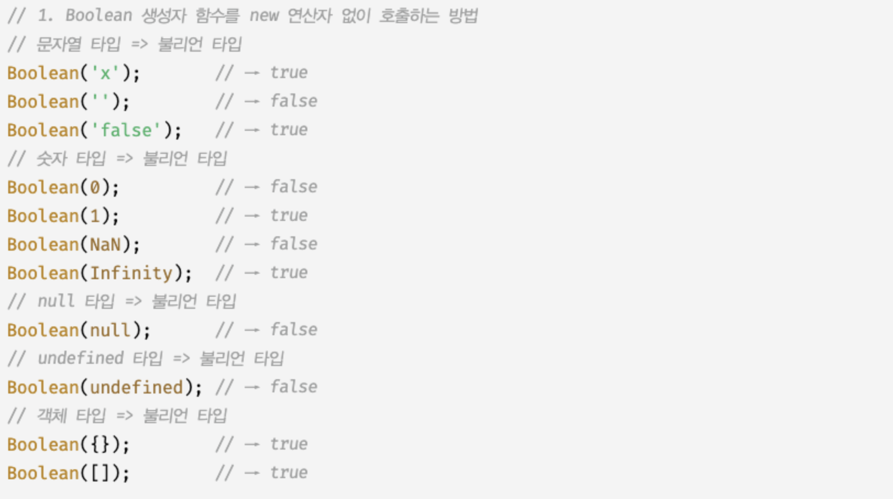
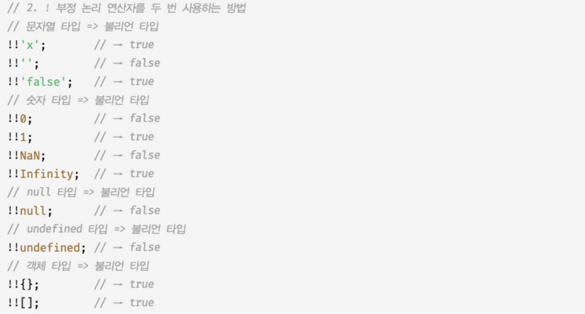
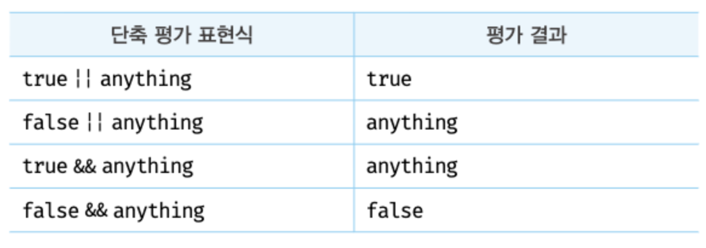

# 09장. 타입 변환과 단축 평가

## 9.1 타입 변환이란?

기존 원시 값을 사용해 다른 타입의 새로운 원시 값을 생성하는 것

- **타입 변환의 종류**

  - **명시적 타입 변환** or **타입 캐스팅** :
    - 개발자가 의도적으로 타입을 변환하는 것
    - 타입을 변경하겠다는 개발자의 의지가 코드에 드러남
  - **암묵적 타입 변환** or **타입 강제 변화** :
    - 개발자의 의도와 상관없이 표현식을 평가하는 도중에 자바스크립트 엔진에 의해 암묵적으로 타입이 자동 변환되는 것
    - 기존 변수 값을 재할당하여 변경한다
    - 자바스크립트는 표현식을 에러 없이 평가하기 위해 피연산자의 값을 암묵적 타입 변환해 새로운 타입의 값을 만들어 **단 한 번 사용하고 버린다.**

- **중요!!**: 코드를 예측할 수 있어야 한다
  - 자신이 작성한 코드에서 **암묵적 타입 변환이 발생하는지**
  - 발생한다면 어떤 타입의 값으로 변환되는지
  - 타입 변환된 값으로 표현식이 어떻게 평가될 것인지

## 9.2 암묵적 타입 변환

자바스크립트 엔진은 표현식을 평가할 때 개발자의 의도와는 상관없이 코드의 문맥을 고려해 암묵적으로 데이터 타입을 강제 변활할 때가 있다.

### 9.2.1 문자열 타입으로 변환

```js
1 + "2"; //->"12"
```

- 피연산자 중 하나 이상이 문자열이므로 + 연산자가 문자열 연결 연산자로 동작.
- 문자열 연결 표현식을 평가하기 위해 문자열 타입이 아닌 피연산자를 문자열 타입으로 암묵적 타입 변환.

```js
`1+1 = ${1 + 1}`; // -> "1+1=2"
```

- 템플릿 리터럴의 표현식 삽입: 표현식의 평가 결과를 문자열 타입으로 암묵적 타입 변환.

### **문자열 타입이 아닌 값을 문자열 타입으로 아묵적 타입 변환을 수행할 때:**



### 9.2.2 숫자 타입으로 변환

피연산자를 숫자 타입으로 변환해야 할 문맥:

- 산술연산자: 산술 연산자의 모든 피연산자는 코드 문맥상 모두 숫자 타입이어야 한다.

  ```js
  1 - "1"; // 0
  1 * "10"; //10
  1 / "one"; //NaN
  ```

- 비교연산자: >비교 연산자는 피연산자의 크기를 비교하므로 모든 피연산자는 코드의 문맥상 모두 숫자 타입이어야 한다.
  ```js
  "1" > 0; //true
  ```
- +단항 연산자: 피연산자가 숫자 타입의 값이 아니면 숫자 타입의 값으로 암묵적 타입 변환을 수행.
  
  

### 9.2.3 불리언 타입으로 변환

- 자바스크립트는 조건식의 평가 결과를 불리언 타입으로 암묵적 타입 변환 한다.
- 자바스크립트 엔진은 불리언 타입이 아닌 값을 Truthy값(참으로 평가되는 값) 또는 Falsy 값(거짓으로 평가되는 값)으로 구분한다. Truthy 값은 true로, Falsy 값은 false로 암묵적 타입 변환 한다.
  - Falsy로 평가 되는 값: - flase - undefined - null - 0,-0 - NaN - ' '(빈 문자열)  
    Falsy 값 외의 모든 값은 모두 truefh vudrk ehlsms Truthy 값이다.

## 9.3 명시적 타입 변환

### 9.3.1 문자열 타입 변환

문자열 타입이 아닌 값을 문자열 타입으로 변환하는 방벙:



### 9.3.2 숫자 타입으로 변환




### 9.3.3 불리언 타입으로 변환




## 9.4 단축 평가

표현식을 평가하는 도중에 평가 결과가 확정된 경우 나머지 평가 과정을 생략하는 것.

### 9.4.1 논리 연산자를 사용한 단축 평가

- 논리합(||) 또는 논리곱(&&)연산자 표현식의 평가 결과는 불리언 값이 아닐 수도 있다. 언제나 2개의 피연산자 중 어으 한쪽으로 평가된다.
- 논리 연산의 결과를 결정하는 피연산자를 타입 변환하지 않고 그대로 반환한다.
  

  - **논리곱(&&)연산자:**

    ```js
    "Cat" && "Dog"; // Dog
    ```

    - 두개의 피연산자가 모두 true로 평가 될 때 true를 반환하고, 좌항에서 우항으로 평가가 진행된다.
    - **두 번째 피연산자가 평가 결과를 결정한다.**

  - **논리합(||)연산자:**

    ```js
    "Cat" || "Dog"; // Cat
    ```

    - 두개의 피연산자 중 하나만 true로 평가되어도 true를 반환한다. 좌항에서 우항으로 평가가 진행된다.
    - **첫 번째 피연산자가 평가 결과를 결정한다.**

- **단축 평가를 사용하면 if문을 대체할 수 있다.**
  - 조건이 Truthy 값일 때 -> 논리곱(&&) 연산자 표현식
    ```js
    //done이 true라면 message에 '완료'를 할당
    message = done && "완료";
    ```
  - 조건이 Falsy 값일 때 -> 논리합(||) 연산자 표현식
    ```js
    //done이 false라면 message에 '미완료'를 할당
    message = done || "미완료";
    ```
  - if...else문은 삼항 조건 연산자로 대체 가능
    ```js
    message = done ? "완료" : "미완료";
    ```

### 9.4.2 옵셔널 체이닝 연산자

- 옵셔널 체이님 연산자 (?.)는 좌항의 피연산자가 null 또는 undefined인 경우 undefined를 반환하고, 그렇지 않으면 우항의 프로퍼티 참조를 이어간다.
- 객체를 가리키기를 기재하는 변수가 null 또는 undefined가 아닌지 확인하고 프로퍼티를 참조할 떄 유용하다.

  ```js
  var elem = null;

  //elem이 null 또는 undefined이면 undefined를 반환하고, 그렇지 않으면 우항의 프로퍼티 참조를 이어간다.
  var value = elem?.value;
  console.log(value); //undefined
  ```

  옵셔넌 체이닝 연산자가 도입되기 이전에는 논리연산자 &&를 사용했다

  ```js
  var elem = null;

  var value = elem && elem.value;
  console.log(value); //null
  ```

- 논리 연산자 && 와 옵션널 체이닝 연산자의 차이
  - 논리 연산자 &&
    - 좌항 피연산자가 false로 평가되는 Falsy 값이면 좌항 피연산자를 그대로 반환한다.
    - 0 이나 ' '은 객체로 평가될 때도 있다.
  - 옵셔널 체이님 연산자 ?.
    - 좌항 피연산자가 false로 평가되는 Falsy 값이라도 null 또는 undefined가 아니면 우항 프로퍼티 참조를 이어간다.

### 9.4.3 null 병합 연산자

- null 병합 연산자 ??는 좌항의 피연산자가 null 또는 undefined인 경우 우항의 피연산자를 반환하고, 그렇지 않으면 좌항의 피연산자를 반환한다.

  ```js
  var foo = null ?? "default string"; //'default string'
  ```

- 변수의 기본값을 설정할 떄 유용하다. null 병합 연산자가 도입되기 전에는 논리 연산자 || 사용
- 논리 연산자 || 와 null 병합 연산자의 차이
  - 논리 연산자 ||
    - 좌항의 피연산자가 Falsy값이면 우항의 피연산자를 반환한다. 만약 Falsy값이 0이나 ''도 기본값으로서 유효하다면 예기치 않은 동작이 발생할 수 있다.
      ```js
      var foo = "" || "default string";
      console.log(foo); // 'default string'
      ```
  - null 병합 연산자
    - 좌항의 피연산자가 Falsy 값이라도 null 또는 undefined가 아니면 좌항의 피연산자를 그대로 반환한다.
      ```js
      var foo = "" ?? "default string";
      console.log(foo); // ' '
      ```
