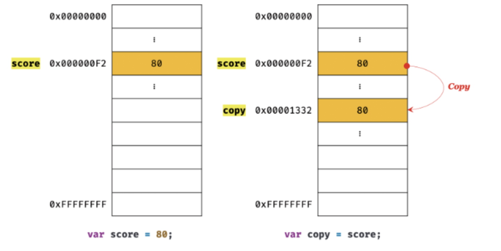
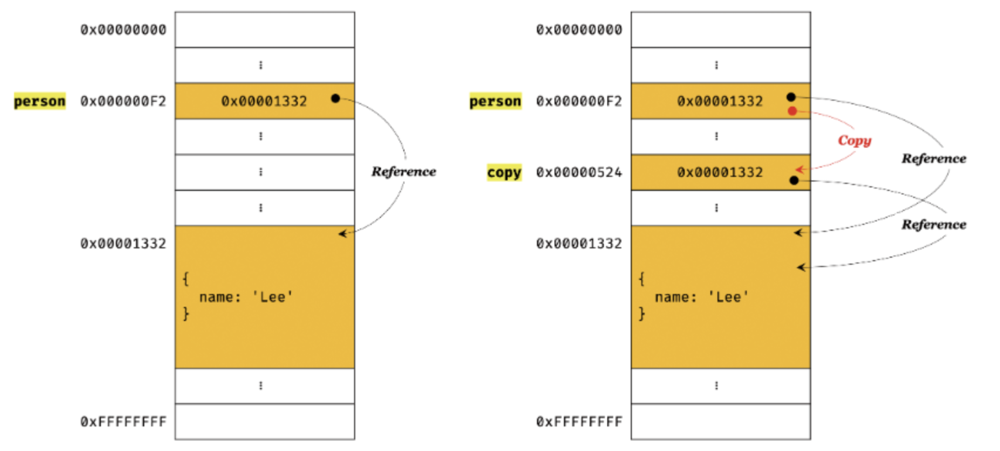

# 11장. 원시 값과 객체의 비교

## 11.1 원시 값

### 11.1.1 변경 불가능한 값

- 원시 값은 변경 불가능한 값이다.
- 변경 불가능하다는 것은 변수가 아니라 값에 대한 진술이다.
- 원시 값 자체 변경 X, 변수 값 변경 O(언제든지 재할당을 통해 변경 가능)
- 상수도 변수지만 재할당이 금지된 변수를 말한다.
- 원시값의 특성: 데이터의 신뢰성 보장
  - 원시 값은 값을 직접 변경할 수 없다.
  - 값을 재할당하면 새로운 메모리 공간을 확보하고 재할당한 값을 저장한 후 , 변수가 참조하던 메모리 공간의 주소를 변경한다.
  - 값의 이러한 특성을 **불변성**이라 한다.
  - 불변성을 갖는 원시 값을 할당안 변수는 재할달 이외에 변수 값을 변경할 수 있는 방법이 없다.

### 11.1.2 문자열과 불변성

- 원시 값을 저장하려면 먼저 확보해야 하는 메모리 공간의 크기를 결정해야 한다. 이를 위해 원시 타입별로 메모리 공간의 크기가 미리 정해져 있다.
- **문자열의 도특한 특징:** 문자열은 몇 개의 문자로 이뤄졌느냐에 따라 필요한 메모리 송간의 크기가 결정된다.
  - 문자열은 0개 이상의 문자로 이뤄진 집합이다
  - 1개의 문자는 2바이트의 메모리 공간에 저장된다.
  - 숫자 값은 1,10000 모두 동일한 8바이트가 필요하지만, 문자열은 1개의 문자로 이뤄진 문자열은 2바이트, 20개의 문자로 이뤄진 문자열은 20바이트가 필요하다.
- 자바스크립트의 문자열은 원시 타입이며, 변경 불가능하다. (생성된 이후에는 변경할 수 없음)
  ```js
  var str = "Hello";
  str = "world";
  ```
  - 두 번째 문이 실행되면 이전에 생성된 문자열 'Hello'를 수정하는 것이 아니라 새로운 문자열 'world'를 메모리에 생성하고 식별자 str은 이것을 가리킨다.
  - 이때 문자열 'Hello'와 'world'는 모두 메모리에 존재한다.
  - 식별자 str은 'Hello'를 가리키고 있다가 'world'를 가리키도록 변경된 것이다.
- 문자열의 한 문자 변경
  - 문자열은 유사 배열 객체이면서 이터러블이므로 배열과 유사하게 각 문자에 접근할 수 있다.

### 11.1.3 값에 의한 전달

변수에 원시값을 갖는 변수를 할당하면 할당받는 변수에는 할당되는 변수의 원시 값이 복사되어 전달된다.

```js
var score = 80;

var copy = score;

console.log(score, copy); //80 80
console.log(score === copy); //true
```

이때 두 변수는 같은 숫자 값80을 가지만, 두 80은 다른 메모리에 저장된 별개의 값이다.

따라서 score 변수의 값을 변경해도 copy변수의 값에는 영향을 주지 않는다.  
**두 변수의 원시 값은 서로 다른 메모리 공간에 저장된 별개의 값이 되어 어느 한쪽에서 재할당을 통해 값을 변경하더라도 서로 간섭할 수 없다.**

## 11.2 객체

### 11.2.1 변경 가능한 값

- **원시 값과 비교:**
  - 객체는 변경 가능한 값이다.
  - 객체를 할당한 변수가 기억하는 메모리 주소를 통해 메모리 공간에 접근하면 참조 값에 접근할 수 있다. (참조 값: 생성된 객체가 저장된 메모리 공간의 주소, 그 자체)
  - 객체를 할당한 변수는 재할당 없이 객체를 직접 변경할 수 있다. 즉, 재할당 없이 프로퍼티를 동적으로 추가할 수 있고, 프로퍼티 값을 갱신할 수 있으면, 프로퍼티 자체를 삭제할 수 있다.
- **객체의 구조적 단점**
  - 객체를 생성하고 관리하는 방식이 매우 복잡하며 비용이 많이 든다
  - 객체는 크기가 매우 클 수도 있고, 원시 값처럼 크기가 일정하지 않으면, 프로퍼티 값이 객체일 수도 있어서 복사사해서 생성하는 비용이 많이 든다.(메모리의 효율적 소비가 어렵고 성능이 나빠진다.) 이를 해결하기 위해 객체는 변경 가능한 값으로 설계되었다.
- **객체의 단점에 따른 부작용:** 여러개의 식별자가 하나의 객체를 공유할 수 있다.

### 11.2.2 참조에 의한 전달

참조에 의한 전달: 객체를 가리키는 변수를 다른 변수에 할당하면 원본의 참조 값이 복사되어 전달되는 것.

```js
var person = {
  name: "Baek",
};

var copy = person;
```



- 원본 person을 사본 copy에 할당하면 원본의 참조 값을 복사해서 copy에 저장한다.
- 이때 원본과 사본은 저장된 메모리 주소는 다르지만 동일한 참조 값을 갖는다.(원본과 사본은 모두 동일한 객체를 가리킨다.)
- 두개의 식별자가 하나의 객체를 공유한다는 것을 의미.
- 따라서 원본 또는 사본 중 어느 한쪽에서 객체를 변경하면 서로 영향을 주고받는다.
