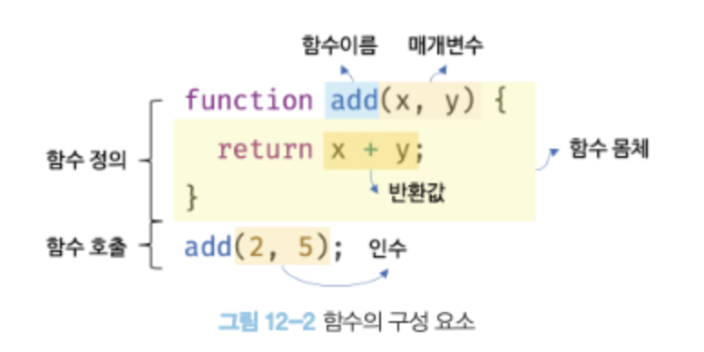
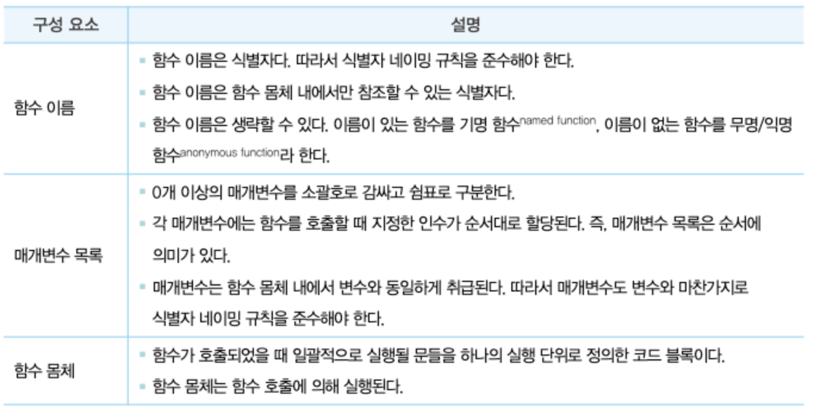
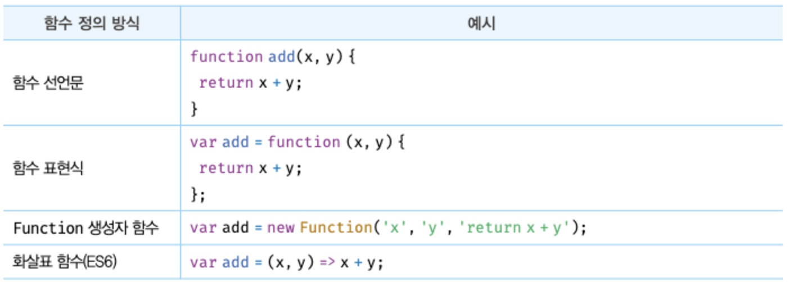
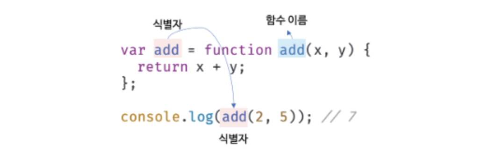
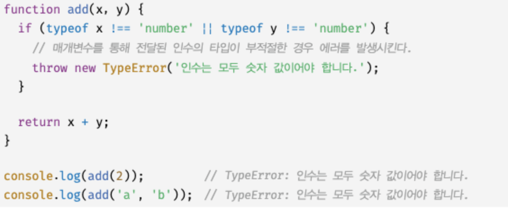
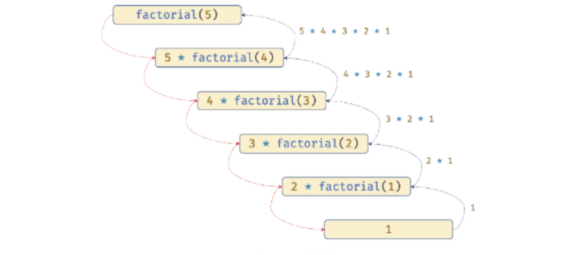

# 12장. 함수

## 12.1 함수란?

- 수학의 함수:'입력'을 받아 '출력'을 보내는 일련의 과정을 전의한 것.
  
- 프로그래밍 언어의 함수:

  - 일련의 과정을 문으로 구현하고 코드 블록으로 감싸서 하나의 실행 단위로 정의한 것

    ```js
    //f(x,y) = x+y
    function add(x, y) {
      return x + y;
    }
    add(2, 5); //7
    ```

  - **함수의 구성 요소**
    
  - 함수는 함수 정의를 통해 생성한다.
  - 함수 호출: 인수를 매개변수를 통해 함수에 전달하면서 함수의 실행을 명시적으로 지시해야 한다.
  - 함수를 호출하면 코드 블록에 담긴 문들이 일괄적으로 실행되고, 실행결과, 즉 반환값을 반환한다.

## 12.2 함수를 사용하는 이유

- 함수는 필요할 때 여러 번 호출할 수 있다.
- 실행 시점을 개발자가 결정할 수 있고 몇 번이든 재사용이 가능하다.
- **코드의 재사용**이라는 측면에서 유용하다.
- 코드의 중복을 억제하고 **유지보수의 편의성**을 높이고 실수를 줄여 **코드의 신뢰성**을 높인다.
- 적절한 함수의 이름은 함수의 내부 코드를 이해하지 않고도 함수의 역할을 파악할 수 있게 도와 **코드의 가독성**을 향상시킨다.

## 12.3 함수 리터럴

- 자바스크립트의 함수는 객체 타입의 값이다.
- 함수 리터럴로 함수를 생성할 수 있다.
  ```js
  //변수에 함수 리터럴을 할당
  var f = function add(x, y) {
    return x + y;
  };
  ```
- 함수 리터럴 구성의 구성 요소
  
- 함수는 객체다
  - 객체지만 일반 객체와 다르다.
  - 일반 객체는 호출할 수 없지만 함수는 호출할 수 있다.

## 12.4 함수의 정의

함수 정의: 함수를 호출하기 이전에 인수를 전달받을 매개변수와 실행할 문들, 그리고 반환할 값을 지정하는 것

- 함수 정의 방식
  

  ### 12.4.1 함수 선언문

  ```js
  function add(x, y) {
    return x + y;
  }
  ```

  - 함수 리터럴과 형태가 동일하다.
  - 함수 리터럴은 함수 이름을 생략할 수 있지만, 함수 선언문은 생략할 수 없다.
  - 함수 선언문은 표현식이 아닌 문이다.
  - 자바스크립트 엔진은 생성된 함수를 호출하기 위해 함수 이름과 동일한 이름의 식별자를 암묵적으로 생성하고, 거기에 함수 객체를 할당한다.
  - 함수는 함수 이름으로 호출하는 것이 아니라 함수 객체를 가리키는 식별자로 호출된다.
    

### 12.4.2 함수 표현식

```js
var add = function (x, y) {
  return x + y;
};
console.log(add(2, 5)); //7
```

- 자바스크립트의 함수는 일급 객체다.
  - 일급 객체(성질을 갖는 객체): 자바스크립트의 함수는 값처럼 변수에 할당할 수도 있고 프로퍼티 값이 될 수도 있으며 배열의 요소가 될 수도 있다.

### 12.4.3 함수 생성 시점과 함수 호이스팅

- 함수 선언문으로 정의한 함수와 함수 표현식으로 정의한 함수는 **생성 시점이 다르다.**
- 함수 선언문으로 함수 정의:
  - 런타임 이전에 함수 객체가 먼저 생성된다.
  - 자바스크립트 엔진은 함수 이름과 동일한 이름의 식별자를 암묵적으로 생성하고 생성된 함수 객체를 할당한다.
  - 코드가 한 줄씩 순차적으로 실행되기 시작하는 런타임에는 이미 함수 객체가 생성되어 있고 함수 이름과 동일한 식별자에 할당까지 완료된 상태다.
  - 함수 선언문 이전에 함수를 참조할 수 있으면 호출할 수도 있다.  
    이 처럼 함수 선언문이 코드 선두로 끌어 올려진 것처럼 동작하는 자바스크립트 고유의 특징을 **함수 호이스팅**이라 한다.

### 12.4.4 Function 생성자 함수

```js
var add = new Function("x", "y", "return x+y");
console.log(add(2, 5));
```

- Function 생성자 함수로 함수를 생성하는 방식은 일반적이지 않으며 바람직하지도 않다.
- 클로저를 생성하지 않는 등, 함수 선언문이나 표현식으로 생성한 함수와 다르게 동작한다.

### 12.4.5 화살표 함수

ES6에서 도입된 좀 더 간략한 함수 선언 방벙. 항상 익명 함수로 정의한다.

```js
const add = (x, y) => x + y;
console.log(add(2, 5)); //7
```

- 기존의 함수 선언문 또는 함수 표현식을 완전히 대체하기 위해 디자인된 것은 아니다.
- 내부 동작도 기존의 함수보다 간략화되어 있다.
- 생성자 함수로 사용할 수 없다
- 기존 함수의 this 바인딩 방식이 다르고, prototype프로퍼티가 없으며 arguments객체를 생성하지 않는다.(뒤에서 자세히)

## 12.5 함수 호출

### 12.5.1 매개변수와 인수

- 매개변수: 함수를 실행하기 위해 필요한 값을 함수 외부에서 함수 내부로 전달할 필요가 있는 경우, 매개변수를 통해 인수를 전달한다.
- 인수: 함수를 호출할 때 지정하며, 개수와 타입에 제한이 없다.
- 함수가 호출될 떄마다 매개변수가 거치는 단계
  .png>)
  - 함수를 정의할 때 선언
  - 함수 몸체 내부에서 변수와 동일하게 취급된다.
  - 함수 몸체 내부에서만 참조할 수 있다. 매개변수의 스코프(유효 범위)는 함수 내부다.
- 매개변수의 개수와 인수의 개수가 일치하지 않는 경우
  - 에러 발생 X
  - 인수가 할당되지 않은 매개변수으 값은 undefined다.
- 매개변수보다 인수가 더 많은 경우:
  - 초과된 인수는 무시된다.
  - 벼려지는 것은 X, 모든 인수는 암묵적으로 arguments객체의 프로퍼티로 보관된다. (arguments에 대해서는 뒤에 더 자세히)

### 12.5.2 인수 확인

- 자바스크립트 함수는 매개변수와 인수의 개수가 일치하는지 확인하지 않는다.
- 자바스크립트는 동적 타입 언어다. 따라서 자바스크립트 함수는 매개변수의 타입을 사전에 지정할 수 없다.
- 따라서 자바스크립의 경우 함수를 정의할 때 인수가 전달되었는지 확인할 필요가 있다.
- 컴파일 시점에 부적절한 호출 방지
  
  - 인수 개수는 확인하지 않지만 arguments 객체를 통해 인수 개수를 확인할 수 있다.
  - 또는 인수가 전달되지 않은 경우 단축 평가를 사용해 매개변수에 기본값을 할당하는 방법도 있다.
  - ES6에서 도입된 매개변수 기본값을 사용하면 함수 내에서 수행하던 인수 체크 및 초기화를 간소화할 수 있다. 매개변수의 기본값은 매개변수에 인수를 전달하지 않았을 경우 undefined를 전달한 경우에만 유효하다.

### 12.5.3 매개변수의 최대 개수

이상적인 함수는 한 가지 일만 해야하며 가급적 작게 만들어야 한다.

- 매개변수는 순서에 의미가 있다.
- 매개변수가 많아지면 함수를 호출할 때 전달해야 할 인수의 순서를 고려해야 한다. 이는 함수의 사용법을 이해하기 어렵게 만들고 실수를 발생시킬 가능성이 높다.
- 매개변수의 개수나 순서가 변경될 경우 함수의 호출 방법도 달라지고, 코드 전체에 영향을 준다. 즉 유지보수성이 나빠진다.
- **따라서 매개변수는 최대 3개 이상을 넘지 않는 것을 권장한다.**

### 12.5.4 반환문

함수느 return 키워드와 표현식(반환값)으로 이뤄진 반환문을 사용해 실행 결과를 함수 외부로 반환할 수 있다.

```js
function multiply(x, y) {
  return x * y; //반환문

  //함수 호출은 반환값으로 평가된다.
  var result = multiply(3, 5); //15
}
```

반환문의 두 가지 역할:

1.  반환문은 함수의 실행을 중단하고 함수 몸체를 빠져나간다. 따라서 반환문 이후에 다른 문이 존재하면 그 문은 실행되지 않고 무시된다.

```js
function multiply(x, y) {
  return x * y; //반환문

  console.log("실행되지 않는다."); //함수 호출은 반환값으로 평가된다.
}
```

2. 반환문은 return 키워드 뒤에 오는 표현식을 평가해 반환한다. return 뒤에 표현식을 명시적으로 지정하지 않으면 undefined가 반환된다.
   - 반환문은 생략 가능: 이 때 함수는 함수 몸체의 마지막 문까지 실행한 후 암묵적으로 undefined를 반환한다.

- 반환문은 함수 몸체 내부에서만 사용할 수 있다. 전역에서 사용하면 문법 에러가 발생한다.
- Node.js는 모듈 시스템에 의해 파일별로 독립적인 파일 스코프를 갖는다. 따라서 파일의 가장 바깥 영역에 반환문을 사용해도 에러 x

## 12.7 다양한 함수의 형태

### 12.7.1 즉시 실행 함수

- 함수 정의와 동시에 호출되는 함수
- 단 한번만 호출되며 다시 호출할 수 없다.

```js
(function () {
  var a = 3;
  var b = 5;
  return a * b;
})();
```

- 즉시 실행 함수는 이름 없는 익명 함수를 사용하는 것이 일반적이다
- 그룹연산자(...)로 감싸야 하는 이유:  
  먼저 함수 리터럴을 평가해서 함수 객체를 생성하기 위함
- 먼저 함수 리터럴을 평가해서 함수 객체를 생성할 수 있다면 그룹 연산자 이외의 연산자를 사용해도 됨. 첫번째가 가장 일반적인 방법.
  
- 즉시 실행 함수도 일반 함수처럼 값을 반환할 수 있고 인수를 전달할 수도 있다.

  ```js
  res = (function (a, b) {
    return a * b;
  })(3, 5);
  console.log(res); //15
  ```

### 12.7.2 재귀 함수

- 자기 자신을 호출하는 행위 , 즉 재귀 호출을 수행하는 함수
- 반복되는 처리를 위해 사용된다.
- 반복문 없이 개귀함수를 통해 팩토리얼 간단히 구현

  ```js
  function factorial(n) {
    if (n <= 1) return 1;

    //재귀 호출
    return n * factorial(n - 1);
  }
  ```

  

  - 함수 내부에서는 함수 이름을 사용해 자기 자신을 호출할 수 있다.
  - 함수 표현식으로 정의한 함수 내부에서는 함수 이름은 물론 함수흫 가리키는 식별자로도 자기 자신을 재귀 호출할 수 있다.
  - 함수 외부에서 함수를 호출할 때는 반드시 함수를 가리키는 식별자로 해야 한다.

- 재귀함수는 자기 자신을 무한 호출하기 때문에 함수 내에서 재귀 호출을 멈출 수 있는 탈출 조건을 반드시 만들어야 한다.
- 재귀 함수 장단점:
  - **장점:**  
    반복되는 처리를 반복문 없이 구현 가능
  - **단점:**
    - 무한 반복에 빠질 위험이 있음
    - 이로 인해 스택 오버플로 에러를 발생 시킬 수 있음

### 12.7.3 중첩 함수

**내부 함수, 중첩함수** : 함수 내부에 정의된 함수.  
**외부 함수** : 중첩 함수를 포함하는 함수.

- 중첩 함수는 외부 함수 내부에서만 호출할 수 있다.
- 일반적으로 자신을 포함하는 외부 함수를 돕는 헬퍼 함수의 역할을 한다.

```js
finction outer(){
  var x = 1;

  //중첩 함수
  function inner(){
    var y = 2;
    //외부 함수의 변수를 참조할 수 있다.
    console.log(x+y)
  }
  inner();
}
outer()
```

### 12.7.4 콜백 함수

**콜백 함수** : 함수의 매개변수를 통해 다른 함수의 배부로 전달되는 함수  
**고차 함수** : 매개변수를 통해 함수의 외부에서 콜백함수를 전달 받은 함수.

- 고차함수는 콜백함수를 자긴의 일부분으로 합성한다.
- 고차함수는 매개변수를 통해 전달받은 콜백함수의 호출시점을 결정해서 호출한다.
- 콜백 함수는 고차 함수에 의해 호출되며 이때 고차함수는 필요에 따라 콜백 함수에 인수를 전달할 수 있다.
- 콜백 함수 활용:
  - 함수형 프로그래밍
  - 비동기 처리
  - 배열 고차 함수

### 12.7.5 순수 함수와 비순수 함수

**순수 함수** :

- 함수형 프로그래밍에서 어떤 외부 상태에 의존하지도 않고 변경하지도 않는, 즉 부수효과가 없는 함수.
- 동일한 인수가 전달되면 언제나 동일한 값을 반환하는 함수
- 오직 매개변수를 통해 함수 내부로 전달된 인수에게만 의존해 값을 생성해 반환한다.
- 일반적으로 최소 하나 이상의 인수를 전달 받는다. 그렇지 않으면 언제나 동일한 값을 반환하므로 상수와 똑같기 때문에 의미가 없다.
- 인수의 불변성을 유지한다.(인수를 변경하지 않는 것이 기본)

**비순수 함수** :

- 외부 상태에 의존하거나 외부 상태를 변경하는, 즉 부수효과가 있는 함수.
- 인수를 전달받지 않고 함수 내부에서 외부 상태를 직접 참조
- 외부상태를 직접 참조하지 않아도 매개변수를 통해 객체를 전달 받으면 비순수 함수다.
- 함수가 외부 상태를 변경하면 상태 변화를 추적하기 어려워진다. 따라서 순수함수를 사용하는 것이 좋다.
