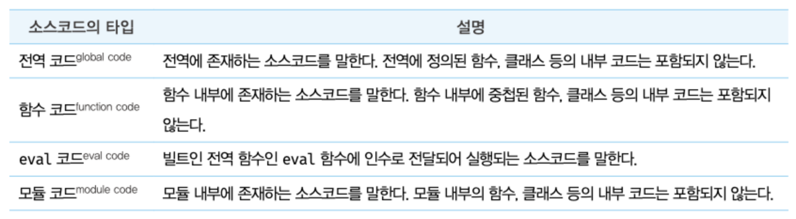
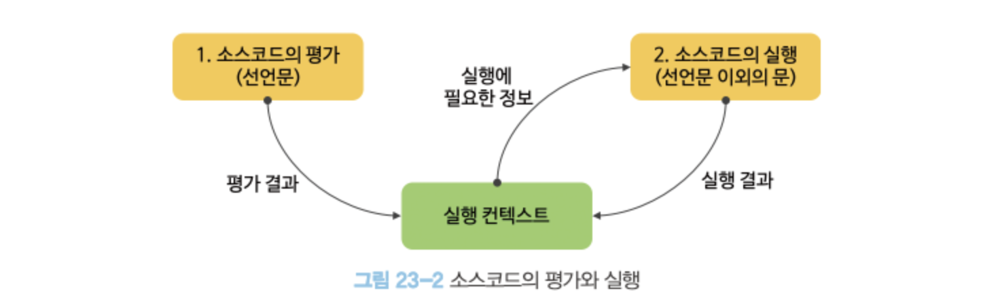
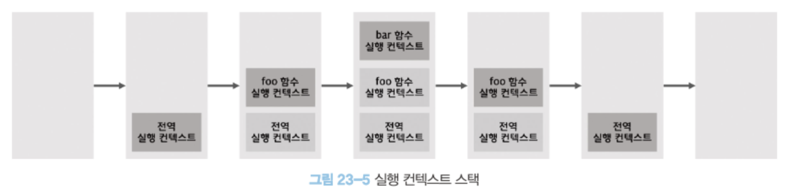
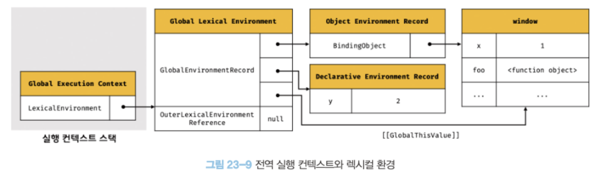

# 23장. 실행 컨텍스트

자바스크립트의 동작 원리를 담고 있는 핵심 개념

## 23.1 소스코드의 타입

ECMAScriptㄴ 사양은 소스코드를 4가지 타입으로 구분한다. 4가지 타입의 소스코드는 실행 컨텍스트를 생성한다.


1. 전역코드
   - 전역 변수를 관리하기 위해 최상위 스코프인 전역 스코프를 생성해야 한다.
   - var 키워드로 선언된 전역 변수와 함수 선언문으로 정의된 전역함수를 전역 객체의 프로퍼티와 메서드로 바인딩하고 참조하기 위해 전역 객체와 연결되어야 한다.
   - 이를 위해 전역 코드가 평가되면 전역 실행 컨텍스트가 생성된다.
2. 함수 코드
   - 기역 스코프를 생성하고 지역변수, 매개변수, arguments 객체를 관리해야 한다.
   - 생성한 지역 스코프를 전역 스크프에서 시작하는 스코프 체인의 일원으로 연결해야 한다.
   - 이를 위해 함수 코드가 평가되면 함수 실행 컨텍스트가 생성된다.
3. eval 코드
   - stric mode(엄격 모드)에서 자신만의 독자적인 스코프를 생성한다.
   - eval 코드가 평가되면 eval 실행 컨텍스트가 생성된다.
4. 모듈 코드
   - 모듈별로 독립적인 모듀 스코프를 생성한다.
   - 모듈 코드가 평가되면 모듈 실행 컨택스트가 생성된다.

## 23.2 소스코드의 평가와 실행

- 자바스크립트는 소스코드를 '소스코드의 평가'와 '소스코드의 실행'과정으로 나누어 처리한다.
- 평가 과정:
  - 실행 컨텍스트 생성 -> 변수, 함수 등의 선언문만 먼전 실행 -> 생성된 변수나 함수 식별자를 키로 실행 컨텍스트가 관리하는 스코프(렉시컬 환경의 환경 레코드)에 등록
- 실행 과정:
  - 평가 과정이 끝나면 런타임이 시작된다.
  - 변수나 함수의 참조를 실행 컨텍스트가 관리하는 스코프에서 검색해서 취득 -> 변수 값의 변경 등 소스코드의 실행 결과는 다시 실행 컨텍스트가 관리하는 스코프의 등록됨
    

## 23.3 실행 컨텍스트의 역할

실행 컨텍스트는 소스코드를 실행하는 데 필요한 환경을 제공하고 코드의 실행 결과를 실제로 관리하는 영역이다. 식별자(변수, 함수, 클래스 등의 이름)를 등록하고 관리하는 스코프와 코드 실행 순서 관리를 구현한 내부 메커니즘으로, 모든 코드는 실행 컨텍스트를 통해 실행되고 관리된다.

- 실행 컨텍스트가 관리하는 것  
  코드가 실행되려면:
  1.  선언에 의해 생성된 모든 식별자(변수, 함수, 클래스 등)를 스코프를 구분하여 등록하고 상태 변화(식별자에 바인딩된 값의 변화)를 지속적으로 관리할 수 있어야 한다.
  2.  스코프 체인을 통해 상위 스코프로 이동하며 식별자를 검색할 수 있어야 한다.
  3.  현재 실행 중인 코드의 실행 순서를 변경할 수 있어야 하며 다시 되돌아갈 수도 있어야 한다.
- 식별자와 스코프는 실행 컨텍스트의 렉시컬 환경으로 관리
- 코드 실행 순서는 실행 컨텍스트 스택으로 관리

## 23.4 실행 컨텍스트 스택

- 자바스크립트 엔진은 먼저 전역 코드를 평가하여 전역 실행 컨텍스트를 생성한다. 그리고 함수가 호출되면 함수 코드를 평가하여 함수 실행 컨텍스트를 생성한다. 이때 생성된 실행 컨텍스트는 스택 자료구조로 관리된다. 이를 **실행 컨텍스트 스택**이라고 부른다.
  
- 실행 컨텍스트 스택은 코드의 실행순서를 관리한다.
- 실행 컨텍스트 스택의 최상위에 존재하는 실행 컨텍스트는 언제나 현재 실행 중인 코드의 실행 컨텍스트다.
- 따라서 최상위에 존재하는 컨텍스트를 **실행 중인 실행 컨텍스트**라 부른다.

## 23.5 렉시컬 환경

- 렉시컬 환경은 식별자와 식별자에 바인딩된 값, 그리고 상위 스코프에 대한 참조를 기록하는 자료구조로 실행 컨텍스트를 구성하는 컨포넌트다. 스코프와 식별자를 관리한다.
- 스코프를 구분하여 식별자를 등록하고 관리하는 저장소 역할을 하는 렉시컬 스코프의 실체.
- 렉시컬 환경은 두 개의 컨포넌트로 구성된다.
  
  1. 환경 레코드
     - 스코프에 포함된 식별자를 등록하고 등록된 식별자에 바인딩된 값을 관리하는 저장소.
     - 소스코드의 타입에 따라 관리하는 내용에 차이가 있다.
  2. 외부 렉시컬 환경에 대한 참조
     - 상위 스코프를 가리킨다.
     - 이때 상위 스코프란 외부 렉시컬 환경, 즉 해당 실행 컨텍스트를 생성한 소스코드를 포함하는 상위코드의 렉시컬 환경을 말한다.
     - 외부 렉시컬 환경에 대한 참조를 통해 단방향 링크드 리스트인 스코프 체인을 구현한다.

## 23.6 실행 컨첵스트의 생성과 식별자 검색 과정

### 23.6.1 전역 객체 생성

- 전역 객체는 전역 코드가 평가되기 이전에 생성된다.
- 이때 전역 객체에는 빌트인 전역 함수, 그리고 표준 빌트인 객체가 추가되며 동작 환경에 따라 클라이언트 사이드 Web API 또는 특정 환경을 위한 호스트 객체흫 포함한다.
- 전역 객체도 Object.prototype을 상속받는다.(전역 객체도 프로토타입 체인의 일원이다.)

### 23.6.2 전약 코드 평가

소스코드가 로드되면 자바스크립트 엔진은 전역 코드를 평가한다. 전역 코드 평가는 다음과 같은 순서로 진행된다.


1.  전역 실행 컨텍스트 생성
    - 비어있는 전역 실행 컨텍스트를 생성하여 실행 컨텍스트 스택에 푸시한다. 이때 전역 실행 컨텍스트는 실행 컨텍스트 스택의 최상위, 즉 실행 중인 컨텍스트가 된다.
2.  전역 렉시컬 환경 생성

    - 전역 렉시컬 환경을 생성하고 전역 실행 컨텍스트에 바인딩한다.

      2.1. 전역 환경 레코드 생성

      - 전역 환경 레코드는 객체 환경 레코드와 선언적 환경 레코드로 구성되어 있다.

        **2.1.1. 객체 환경 레코드 생성**

        - BindingObject(전역 객체 생성에서 생성된 전역 객체)라고 부르는 객체와 연결된다.
        - 전역 코드 평가 과정에서 var 키워드로 선언한 전역 변수와 함수 선언문으로 정의된 전역 함수는 전역 환경 레코드에 연결된 BindingObject를 통해 전역 객체의 프로퍼티와 메서드가 된다.

        **2.1.2. 선언적 환경 레코드 생성**

        - var 키워드로 선언한 변수와 함수 선언문으로 정의한 전경 함수 이외의 선언, 즉 let, const 키워드로 선언한 전역 변수는 선언적 환경 레코드에 등록된다.
        - const 키워드로 선언한 변수는 '선언 단계'와 '초기화 단계'가 분리되어 진행 된다. 따라서 초기화 단계(런타임)에 실행 흐름이 변수 선언문에 도달하기 전까지 일시적 사각지대에 빠지게 된다.

        2.2. this 바인딩

    - 전역 환경 레코드의 [[GlobalThisValue]] 내부 슬롯에 this가 바인딩된다.
    - 전역코드에서 this는 전역 객체를 가리키므로 전역 환경 레코드의 [[GlobalThisValue]] 내부 슬롯에는 전역 객체가 바인딩된다.
    - 전역 코드에서 this를 참조하면 전역 환경 레코드의 [[GlobalThisValue]] 내부 슬롯에 바인딩되어 있는 객체가 반환된다.
    - 객체 환경 레코드와 선언적 환경 레코드에는 this 바인딩이 없다.

      2.3. 외부 렉시컬 환경에 대한 참조 결정

    - 외부 렉시컬에 대한 참조는 현재 평가 중인 소스코드를 포함하는 외부 소스코드의 렉시컬 환경, 즉 상위 스코프를 가리킨다.
    - 이를 통해 단방향 링크드 리스트인 스코프 체인을 구현한다.

### 23.6.3 전역 코드 실행

이제 전역 코드가 순차적으로 실행되기 시작한다. 변수 할당문이 실행되어 전역 변수에 값이 할당된다. 그리고 함수가 호출된다.

- 변수 할당문 또는 함수 호출문을 실행하려면 먼저 변수 또는 함수 이름이 선언된 식별자인지 확인해여 한다.
- 식별자는 스코프가 다르면 같은 이름을 가질 수 있기 때문에 어느 스코프릐 식별자를 참도하면 되는지 결정해야 한다. 이를 **식별자 결정**이라 한다.
- 식별자를 검색할 때는 실행 중인 실행 컨텍스트에서 식별자를 검색하기 시작한다.

## 23.7 실행 컨텍스트와 블록 레벨 스코프

- let, const 키워드로 선언한 변수는 모든 코드 블록(함수, if문, for문, while문, try/catch문 등)을 지역 스코프로 인정하는 블록 레벨 스코프를 따른다.

  ```js
  let x = 1;
  if (true) {
    let x = 10;
    console.log(x); //10
  }
  console.log(x); // 1
  ```

  - if 문의 코드 블록 내에서 let 키워드로 변수가 선언됨.
  - if 문의 코드 블록이 실행되면 if 문의 코드 블록을 위한 블록 스코프를 생성해야 한다.
  - 이를 위해 선언적 환경 레코드를 갖는 렉시컬 환경을 새롭게 생성하여 기존의 전역 렉시컬 환경을 교체한다.
  - 새롭게 생성된 if 문의 코드 블록을 위한 렉시컬 환경의 외부 렉시컬 환경에 대한 참조는 if문이 실행되기 이전의 정역 렉시컬 환경을 가리킨다.
  - if문 코드 블록의 실행이 종료되면 if문의 코드 블록이 실행되기 이전의 렉시컬 환경으로 되돌린다.
  - 이는 if 문뿐 아니라 블록 레벨 스코프를 생성하는 모든 블록문에 적용된다.
