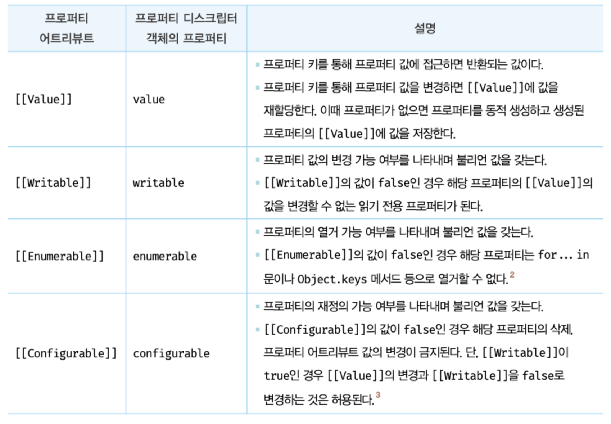
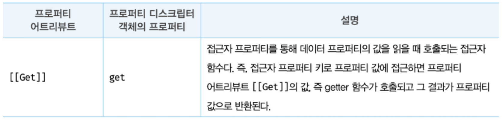
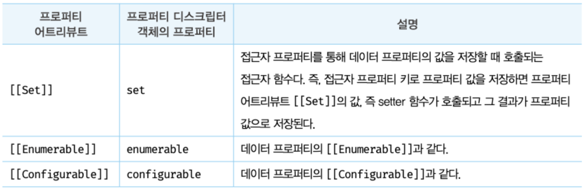
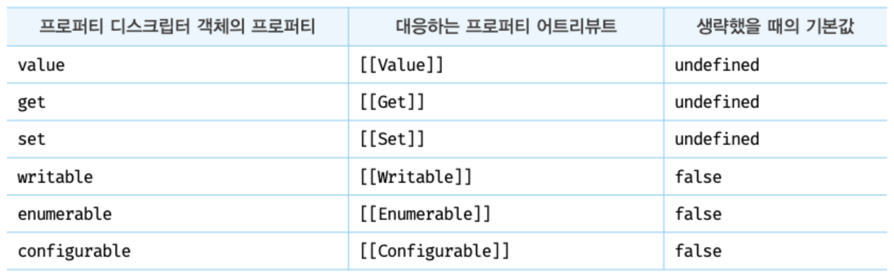
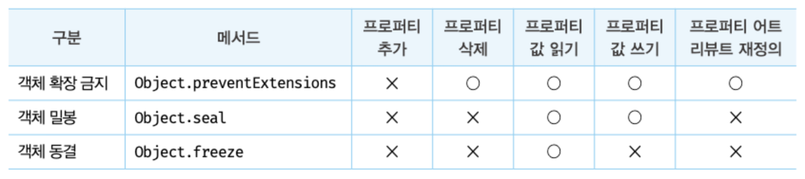

# 16장. 프로퍼티 어트리뷰트

## 16.1 내부 슬롯과 내부 메서드

내부 슬롯과 내부 메서드는 자바스크립트 엔진의 구현 알고리즘을 설명하기 위해 ECMAScript 사양에서 사용하는 의사 프로퍼티와 의사 메서드다. ECMAScript 사양에 등장하는 이중 대괄호([[...]])오 감싼 이름들이 내부 슬롯과 내부 메서드다.

- 모든 객체는 [[Prototype]]이라는 내부 슬롯을 갖는다.
- 내부 슬롯은 자바스크립트 엔진의 내부 로직이므로 원칙적으로 직접 접근할 수 없지만 [[Prototype]] 내부 슬롯의 경우, **proto**를 통해 간접적으로 접근할 수 있다.

  ```js
  const o = {};

  o.[[Prototype]]

  o.__proto__
  ```

## 16.2 프로퍼티 어트리뷰트와 프로퍼티 디스크립트 객체

- 자바스크립트 엔진은 프로퍼티를 생성할 때 프로퍼티의 상태를 나타내는 프로퍼티 어트리뷰트를 기본값으로 자동 정의한다.
- 프로퍼티 어트리뷰트: 자바스크립트 엔진이 관리하는 내부 상태 값인 내부 슬롯 [[Value]], [[Writable]], [[Enumerable]], [[Configurable]]이다.
- 프로퍼티 어트리뷰트에 직접 접근할 수 없지만 Object.getOwnPropertyDescriptor 메서드를 사용하여 간접적으로 확인할 수는 있다.

  ```js
  const person = {
    name: "Lee",
  };

  console.log(Object.getOwnPropertyDescriptor(person, "name"));
  //Object.getOwnPropertyDescriptor(객체의 참조, '프로퍼티 키')
  //{value: "Lee", writable: true, enumrable: true, configurable: true}
  ```

## 16.3 데이터 프로퍼티와 접근자 프로퍼티

프로퍼티는 데이터 프로퍼티와 접근자 프로퍼티로 구분할 수 있다.

- **데이터 프로퍼티:**  
   키와 값으로 구성된 일반적인 프로퍼티. 지금까지 살펴본 모든 프로퍼티는 데이터 프로퍼티다.
- **접근자 프로퍼티**  
  자체적으로는 값을 갖지 않고 다른 데이터 프로퍼티의 값을 읽거나 저장할 때 호출되는 접근자 함수로 구성된 프로퍼티.

### 16.3.1 데이터 프로퍼티

다음과 같은 프로퍼티 어트리뷰트를 갖는다. 이 프로퍼티는 자바스크립트 엔진이 프로퍼티를 생성할 떄 기본값으로 자동 정의된다.


### 16.3.2 접근자 프로퍼티

다음과 같은 프로퍼티 어트리뷰트를 갖는다.



- 접근자 함수는 getter/setter함수라고도 부른다.(앞에 get, set이 붙은 메서드)
- 접근자 프로퍼티는 getter와 setter 함수를 모두 정의할 수도 있고 하나만 정의할 수도 있다.
- 접근자 프로퍼티로 프로퍼티 값에 접근하면 내부적으로 [[Get]] 내부 메서드가 호출되어 다음과 같이 동작한다.
  - 프로퍼티 키가 유효한지 확인한다. 프로퍼티 키는 문자열 또는 심벌이어야 한다.
  - 프로퍼티 타입 체인에서 프로퍼티를 검색한다.
  - 검색된 프로퍼티가 데이터 프로퍼티인지 접근자 프로퍼티인지 확인한다.
  - 프로퍼티의 프로퍼티 어트리뷰트[[Get]]의 값, 즉 getter함수를 호출하여 그 결과를 반환한다.
- 접근자 프로퍼티와 데이터 프로퍼티를 구별하는 방법

  ```js
  //일반 객체의 __proto__는 접근자 프로퍼티다.
  Object.getOwnPropertyDescriptor(Object.prototype, "__proto__");
  //{get: f, set: f, enumerable: false, configurable: true}

  //함수 객체의 prototype은 데이터 프로퍼티다.
  Object.getOwnPropertyDescriptor(function () {}, "prototype");
  //{value: {...}, writable: true, enumerable: false, configurable: false}
  ```

## 16.4 프로퍼티의 정의

- 프로퍼티의 정의란 새로운 프로퍼티를 추가하면서 프로퍼티 어트리뷰트를 명시적으로 정의하거나, 기존 프로퍼티의 프로퍼티 어트리뷰트를 재정의 하는 것을 말한다.
- Object.defineProperty 메서드를 사용하면 프로퍼티의 어트리뷰트를 정의할 수 있다. 인수로는 객체의 참조와 데이터 프로퍼티의 키인 문자열, 프로퍼티 디스크립터 객체를 전달한다.
- Object.defineProperty 메서드로 프로퍼티를 정의할 때 프로퍼티 디스크립터를 일부 생략할 수 있다. 프로퍼티 디스크립터 객체에서 생략된 어트리뷰트는 다음과 같이 기본값이 적용된다.
  
- Object.defineProperty 메서드는 한번에 하나의 프로퍼티만 정의할 수 있다. Object.defineProperties 메서드를 사용하면 여러 개의 프로퍼티를 한 번에 정의할 수 있다.

## 16.5 객체 변경 방지

- 객체는 변경 가능한 값이므로 재할당 없이 직접 변경할 수 있다. 즉, 프로퍼티를 추가하거나 삭제할 수 있고, 프로퍼티 값을 갱신할 수 있으면, Object.defineProperty 또는 Object.defineProperties 메서드를 사용하여 프로퍼티 어트리뷰트를 재정의할 수도 있다.
- 자바스크립트의 객체의 젼경을 방지하는 다양한 메서드. 각각 변경을 금지하는 강도가 다르다.
  
  ### 16.5.1 객체 확장 금지 Object.preventExtensions
  - 객체 확장 금지란 프로퍼티 추가 금지를 의미한다.
  - 확장이 금지된 객체는 프로퍼티 추가가 금지된다.
  - 프로퍼티 동적 추가와 Object.definProperty 두가지 추가 방법이 모두 금지된다.
  - 확장 가능 여부는 Object.isExtensible 메서드로 확인할 수 있다.
  ### 16.5.2 객체 밀봉 Object.seal
  - 객체 밀봉이란 프로퍼티 추가 및 삭제와 프로퍼티 어트리뷰트 재정의 금지를 의미한다.
  - 밀봉된 객체는 읽기와 쓰기만 가능하다.
  - 밀봉된 객체인지 여부는 Object.isSealed 메서드로 확인 가능.
  ### 16.5.3 객체 동결 Object.freeze
  - 객체 동결이란 프로퍼티 추가 및 삭제와 프로퍼티 어트리부트 재정의 금지, 프로퍼티 값 갱신 금지를 의미한다.
  - 동결된 객체는 읽기만 가능하다.
  - 동결된 객체인지 여부는 Object.isFrozen 메서드로 확인 가능.
  ### 16.5.4 불변 객체
  지금까지 살펴본 변경 방지 메서드들은 **얕은 변경 방지**로 직속 프로퍼티만 변경이 방지되고 중첩 객체까지는 영향을 주지 않는다.  
  객체의 중첩 객체까지 동결하여 변경이 불가능한 읽기 전용의 불변 객체를 구현하려면 객체를 값으로 갖는 모든 프로퍼티에 대해 대귀적으로 Object.freeze 메서드를 호출해야 한다.
