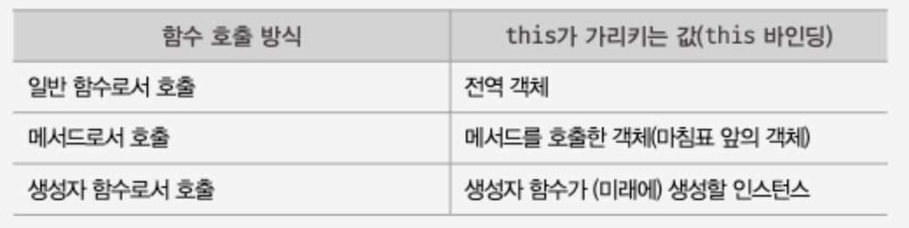
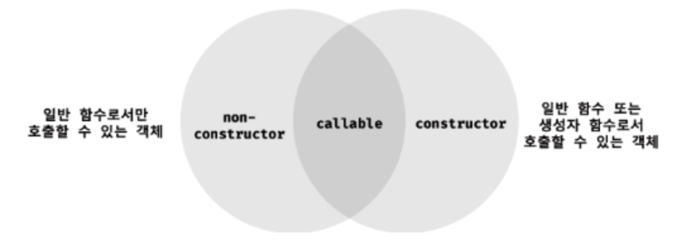

# 17장. 생성자 함수에 의한 객체 생성

## 17.1 Object 생성자 함수

new 연산자와 함께 Object 생성자 함수를 호출하면 빈 객체를 생성하여 반환한다. 빈 객채를 생성한 이후 프로퍼티 또는 메서드를 추가하여 객체를 완성할 수 있다.

```js
//빈 객체의 생성
const person = new Object();

//프로퍼티 추가
person.name = "Lee";
person.sayHello = function () {
  console.log("Hi! My name is" + this.name);
};

console.log(person); //{name:"Lee", sayHello: f}
person.sayHello(); //Hi! My name is Lee
```

- 생성자 함수: new 연산자와 함께 호출하여 객체(인스턴스)를 생성하는 함수
- 인스턴스: 생성자 함수에 의해 생성된 객체
- 자바 스크립트는 Object 생성자 함수 이외에도 String, Number, Boolean, Function, Array, Date, RegExp, Promise 등의 빌트인 생성자 함수를 제공한다.
  
  - 반드시 Object 생성자 함수를 사용해 빈 객체를 생성해야 하는 것은 아니다.(특별한 이유가 없다면 그다지 유용하지 않음)

## 17.2 생성자 함수

### 17.2.1 객체 리터럴에 의한 객체 생성 방식의 문제점

- 객체는 프로퍼티를 통해 객체 고유의 상태를 표현한다.
- 메서드를 통해 상태 데이터인 프로퍼티를 참조하고 조작하는 동작을 표현한다.
- 따라서 프로퍼티는 객체마다 프로퍼티 값이 다를 수 있지만 메서드는 내용이 동일한 경우가 일반적이다.
- 객체 리터럴에 의한 객체 생성 방식은 직관적이고 간편하다. 하지만 이 방식은 단 하나의 객체만 생성한다. 따라서 동일한 프로퍼티를 갖는 객체를 여러 개 생성해야 하는 경우 매번 같은 프로퍼티를 기술해야 한기 때문에 비효율적이다.

### 17.2.2 생성자 함수에 의한 객체 생성 방식의 장점

생성자 함수에 의한 객체 생성 방식은 마치 객체(인스턴스)를 생성하기 위한 템플릿(클래스)처럼 생성자 함수를 사용하여 프로퍼티 구조가 동일한 객체 여러개를 간편하게 생성할 수 있다.

```js
//생성자 함수
function Circle(radius) {
  //생성자 함수 내부의 this는 생성자 함수가 생성할 인스턴스를 가리킨다.
  this.radius = radius;
  this.getDiameter = function () {
    return 2 * this.radius;
  };
}

//인스턴스 생성
const circle1 = new Circle(5); // 반지름이 5인 Circle 객체를 생성
const circle2 = new Circle(10); // 반지름이 10인 Circle 객체를 생성

console.log(circle1.getDiameter()); // 10
console.log(circle2.getDiameter()); // 20
```

- this : 객체 자신의 프로퍼티나 메서드를 참조하기 위한 자기 참조 변수. this가 가리키는 값, 즉 this바인딩은 함수 호출 방식에 따라 동적으로 결정된다.
  

### 17.2.3 생성자 함수의 인스턴스 생성 과정

- 생성자 함수의 역할 :
  - 프로퍼티 구조가 동일한 인스턴스를 생성하기 위한 템플릿(클래스)으로서 동작
  - 인스턴스 생성 -> 필수
  - 생성된 인스턴스를 초기화(인스턴스 프로퍼티 추가 및 초기값 할당) -> 옵션
- new 연산자와 함께 생성자 함수를 호출하면 자바스크립트 엔진은 다음과 같은 과정을 거쳐 암묵적으로 인스턴스를 생성하고 인스턴스를 초기화 한 후 암묵적으로 인스턴스를 반환한다.
  1. 인스턴스 갱성과 this 바인딩
     - 암묵적으로 빈 객체(아직 완성되지 않은 생성자 함수가 생성한 인스턴스) 생성 -> 인스턴스는 this에 바인딩 된다
     - 생성자 함수 내부의 this가 생성자 함수가 생성할 인스턴스를 가리키는 이유이다.
     - 이 처리는 런타임 이전에 실행된다.
  2. 인스턴스 초기화
     - 생성자 함수에 기술되어 있는 코드가 한 줄씩 실행되어 this에 바인딩되어 있는 인스턴스를 초기화한다. (this에 바인딩되어 있는 인스턴스에 프로퍼티나 메서드를 추가하고 생성자 함수가 인수로 전달 받은 초기값을 인스턴스로 프로퍼티에 할당하여 초기화하거나 고정값을 할당한다.)
     - 이 처리는 개발자가 기술한다.
  3. 인스턴스 반환
     - 생성자 함수 내부에서 모든 처리가 끝나면 완성된 인스턴스가 바인딩 된 this를 암묵적으로 반환한다.
     - 만약 this가 아닌 다른 객체를 명시적으로 반환하면 this가 반환되지 못하고 retutn 문에 명시한 객체가 반환된다.
     - 명시적을 원시 값을 반환하면 원시 값 반환은 무시되고 암묵적으로 this가 반환된다.
     - 생성자 함수 내에서는 return문을 반드시 생략해야 한다.

### 17.2.4 내부 메서드 [[Call]]과 [[Construct]]

- 함수는 객체이지만 일반 객체와 다르다. **일반 객체는 호출할 수 없지만 함수는 호출할 수 있다. **
- 함수는 일반 객체가 가지고 있는 내부 슬롯과 내부 메서드는 물론, 함수로서 동작하기 위해 함수 객체만을 위한 [[Environment]], [[FormalParameters]]등의 내부 슬롯과 [[Call]], [[Construct]]같은 내부 메서드를 추가로 가지고 있다.

**[[Call]]**

- 함수가 일반 함수로서 호출되면 함수 객체의 내부 메서드 [[Call]]이 호출된다.
- 내부 메서드 [[Call]]를 갖는 함수 객체를 callable이라 한다.
- callable은 호출할 수 있는 객체 즉, 함수를 말한다.
- 호출할 수 없는 객체는 함수가 아니므로 함수로서 기능하는 객체, 즉 함수 객체는 반드시 callable이어야 한다. 따라서 모든 함수 객체는 내부 메서드 [[Call]]을 갖고 있으므로 호출할 수 있다.

**[[Construct]]**

- new 연산자와 함께 생성자 함수로서 호출되면 내부 메서드 [[Construct]]가 호출된다.
- 내부 메서드 [[Construct]]를 갖는 함수 객체를 constructor이라 한다. [[Construct]]를 갖지 않는 함수 객체는 non-constructor라고 부른다.
- constructor는 생성자 함수로서 호출할 수 있는 함수, non-constructor는 객체를 생성자 함수로서 호출할 수 없는 함수를 의미한다.
- 모든 함수 객체가 [[Constructor]]를 갖는 것은 아니다.

**결론: 모든 함수 객체는 호출할 수 있지만 모든 함수 객체를 생성자 함수로서 호출할 수 있는 것은 아니다.**


### 17.2.5 constructor와 non-constructor의 구분

자바스크립트 엔진은 함수 정의를 평가하여 함수 객체를 생성할 때 함수 정의 방식에 따라 함수를 constructor와 non-constructor로 구분한다.

- constructor: 함수 선언문, 함수 표현식, 클래스(클래스도 함수다)
- non-constructor: 메서드(ES6 메서드 축약 표현), 화살표 함수

주의할 점: 생성자 함수로서 호출될 것을 기재하고 정의하지 않은 일반함수(callable이면서 constructor)에 new 연산자를 붙여 호출하면 생성자 함수처럼 동작할 수 있다.

### 17.2.6 new연산자

- 일반 함수와 생성자 함수에 특별한 형식적 차이는 없다. new연산자와 함께 함수를 호출하면 해당 함수는 생성자 함수로 동작한다. 함수 객체의 내부 메서드 [[Call]]이 호출되는 것이 아니라 [[Constructor]]가 호출된다.
- new연산자와 함께 호출하는 함수는 non-constructor가 아닌 constructor이어야 한다.
- new연산자 없이 함수를 생성하면 일반 함수로 호출된다.
- 일반 함수와 생성자 함수는 특별한 형식적 차이가 없기 때문에 생성자 함수는 일반적으로 파스칼케이스로 명명하여 일반 함수와 구별할수 있도록 하는게 좋다.

### 17.2.7 new.target

생성자 함수가 new 연산자 없이 호출되는 실수를 방지하기 위해 ES6에서 new.target을 지원한다.

- new 연산자와 함께 생성자 함수로서 호출되면 함수 내부의 new.target은 함수 자신을 가리킨다.
- new연산자 없이 일반 함수로서 호출된 함수 내부의 new.target은 undefined다.
