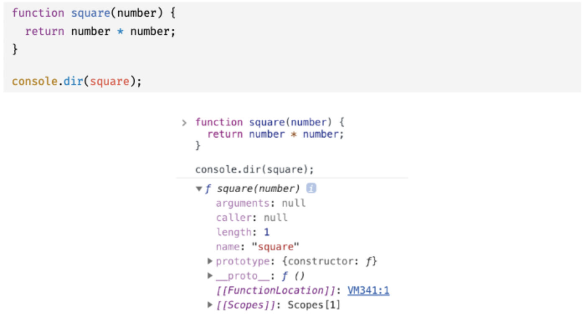
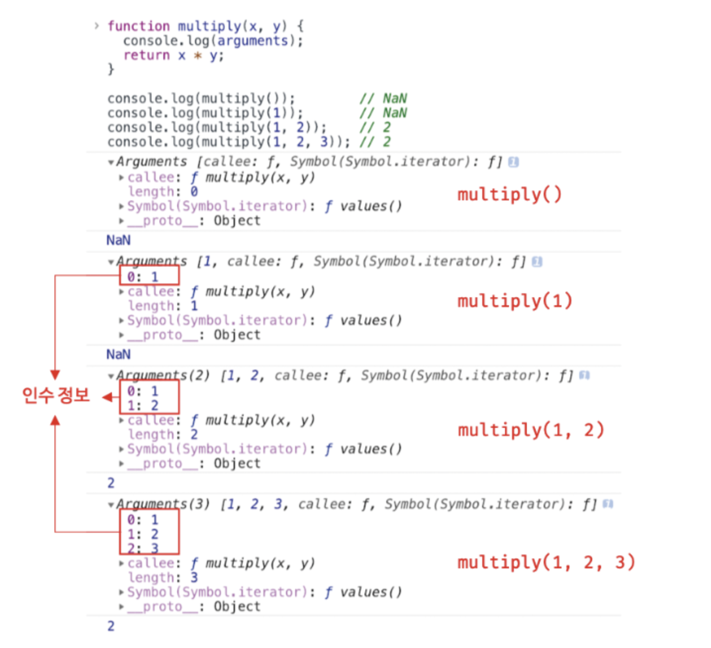

# 18장. 함수와 일급 객체

## 18.1 일급 객체

자바스크립트의 함수는 일급 객체이다.

**일급 객체의 조건:**

- 무명의 리터럴로 생성할 수 있다. 즉 런타임에 생성이 가능하다.
- 변수나 자료구조(객체, 배열 등)에 정장할 수 있다.
- 함수의 매개변수에 전달할 수 있다.
- 함수의 변환가뵤으로 사용할 수 있다.

## 18.2 함수 객체의 프로퍼티

함수는 객체다. 따라서 함수도 프로퍼티를 가질 수 있다.

**함수 객체의 프로퍼티**


- arguments, caller, length, name, prototype 프로퍼티는 모두 함수 객체의 데이터 프로퍼티다. 일반 객체에는 없는 함수 객체 교유의 프로퍼티다.
- **proto**는 접근자 프로퍼티이며, 함수 객체 교유의 프로퍼티가 아니라 Object.prototype 객체의 프로퍼티를 상속받은 것이다. 모든 객체가 사용할 수 있다.

  ### 18.2.1 arguments 프로퍼티

  - 함수 객체의 arguments 프로퍼티 값은 arguments 객체다.
  - 함수 호출 시 전달된 인수들의 정보를 담고 있는 순회 가능한 유사 배열 객체이며, 함수 내부에서 지역 변수처럼 사용된다. (함수 외부에서는 참조할 수 없다.)
  - 현재 일부 브라우저에서 지원하고 있지만 ES3부터 표준에서 폐지되었다. 따라서 Function.arguments와 같은 사용법은 권장되지 않으며 함수 내부에서 지역 변수처럼 사용할 수 있는 arguments객체를 참조하도록한다.
  - 함수를 정의할 때 선언한 매개뱐수는 함수 몸체 내부에서 변수와 동일하게 취급된다. 즉, 함수가 호출되면 함수 몸체 내에서 암묵적으로 매개변수가 선언되고 undefined로 초기화된 이후 인수가 할당된다.
    - 선언된 매개변수의 개수보다 인수를 적게 전달했을 경우 인수가 전달되지 않은 매개변수는 undefined로 초기화된 상태를 유지한다.
    - 매개변수의 개수보다 인수를 많이 전달한 경우 초과된 인수는 무시된다. (벼려지는 것 X) 모든 인수는 암묵적으로 arguments 객체의 프로퍼티로 보관된다.
      

- arguments객체는 매개변수를 확장할 수 없는 가변 인자 함수를 구현할 때 유용하다.

### 18.2.2 caller 프로퍼티

caller프로퍼티는 ECMAScript 사양에 포한되지 않은 비표준 프로퍼티다. 이후 표준화될 예정도 없음. 사용하지 말고 참고로만 알아둘 것. 관심이 없다면 지나쳐도 좋음.

### 18.2.3 length 프로퍼티

함수를 정의할 때 선언한 매개변수의 개수를 가리킨다.

- arguments객체의 length 프로퍼티: 인자의 개수
- 함수 객체의 length: 매개변수의 개수

### 18.2.4 name 프로퍼티

함수 이름을 나타낸다. ES6이전까지는 비표준이었다가 ES6에서 정식 표준이 되었다.  
ES5와 ES6에서 동작을 달리하므로 주의해야 함.

```js
//익명 함수 표현식
var anonymousFunc = function () {};
//ES5: name프로퍼티는 빈 문자열을 값으로 갖는다.
//ES6: name프로퍼티는 함수 객체를 가리키는 변수 이름을 값으로 갖는다.
console.log(anonymousFunc.name); // anonymousFunc
```

### 18.2.5 **proto**접근자 프로퍼티

모든 객체는 [[Prototype]]이라는 내부 슬롯을 갖는다. [[Prototype]] 내부 슬롯은 객체지향 프로그래밍의 상속을 구련하는 프로토타입 객체를 가리킨다.

- **proto**프로퍼티는 [[Prototype]]내부 슬롯이 가리키는 프로토타입 객체에 접근하기 위해 사용하는 접근자 프로퍼티다.
- 내부 슬롯에는 직접 접근할 수 없고 간접적인 접근 방법을 제공하는 경우에 한하여 접근할 수 있다.

### 18.2.6 prototype 프로퍼티

- 생성자 함수로 호출할 수 있는 함수 객체, 즉 constructor만이 소유하는 프로퍼티다.
- 함수가 객체를 생성하는 생성자 함수로 호출될 때 생성자 함수가 생성할 인스턴스의 프로토타입 객체를 가리킨다.
