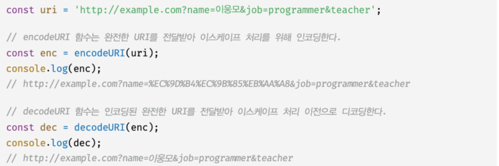
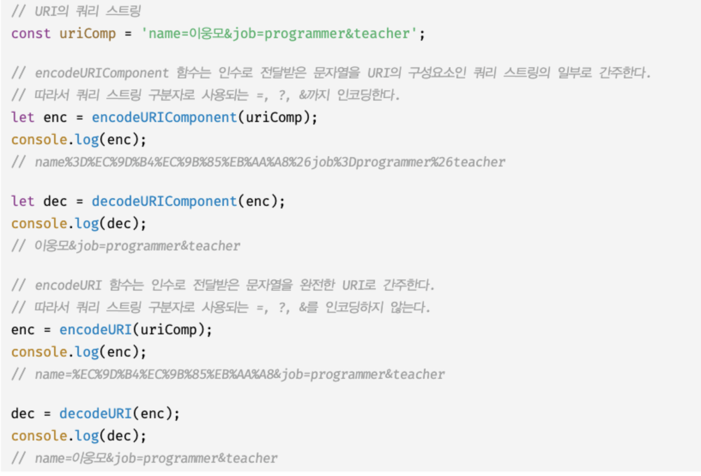

# 21장. 빌트인 객체

## 21.1 자바스크립트 객체의 분류

자바스크립트 객체는 다음과 같이 크게 3개의 객체로 분류할 수 있다.

- 표준 빌트인 객체
  - ECMAScript 사양에 정의된 객체를 말하며, 애플리케이션 전역의 공통 기능을 제공한다.
  - 자바스크립트 환경과 관계없이 언제나 사용할 수 있다.
  - 전역 객체의 프로퍼티로서 제공된다. 따라서 별도의 선언 없이 전역 변수처럼 언제나 참조할 수 있다.
- 호스트 객체

  - ECMAScript 사양에 정의되어 있지 않지만 자바스크립트 실행 환경에서 추가로 제공하는 객체를 말한다.
  - 브라우저 환경에서는 클라이언트 사이드 Web API를 호스트 객체로 제공하고, Node.js환경에서는 Node.js 고유의 API를 호스트 객체로 제공한다.

- 사용자 정의 객체
  - 표준 빌트인 객체와 호스트 객체처럼 기본 제공되는 객체가 아닌 사용자가 직접 정의한 객체를 말한다.

## 21.2 표준 빌트인 객체

- 자바스크립트는 Object, String, Number, Boolean, Symbol, Math 등 40여개의 표준 빌트인 객체를 제공한다.
- Math, Reflect, JSON을 제외한 표준 빌트인 객체는 모두 인스턴스를 생성할 수 있는 생성자 함수 객체다.
- 생성자 함수 객체인 표준 빌트인 객체는 프로토타입 메서드와 정적 메서드를 제공하고 생성자 함수 객체가 아닌 표준 빌트인 객체는 정적 메서드만 제공한다.  
  ex) 표준 빌트인 객체인 String, Number, Boolean, Function, Array, Date는 생성자 함수로 호출하여 인스턴스를 생성할 수 있다.
  ```js
  // Stirng 생성자 함수에 의한 String 객체 생성
  const strObj = new String("Lee"); // String{'Lee'}
  console.log(typeof strObj); // object
  ```
- 생성자 함수인 표준 빌트인 객체가 생성한 인스턴스의 프로토타입은 표준 빌트인 객체의 prototype 프로퍼티에 바인딩된 객체다.  
  ex) 표준 빌트인 객체인 String을 생성자 함수로서 호출하여 생성한 String 인스턴스의 프로토타입은 String.prototype이다.
- 표준 빌트인 객체의 prototype 프로퍼티에 바인딩된 객체는 다양한 기능의 빌트인 프로토타입 메서드를 제공한다. 그리고 표준 빌트인 객체는 인스턴스 없이도 호출 가능한 빌트인 정적 메서드를 제공한다.

## 21.3 원시값과 래퍼 객체

문자열이나 숫자, 불리언 값에 대해 객체처럼 접근하면 생성되는 임시 객체를 래퍼 객체라 한다.

## 21.4 전역 객체

코드가 실행되기 이전 단계에 자바스크립트 엔진에 의해 어떤 객체보다도 먼저 생성되는 특수한 객체이며, 어떤 객체에도 속하지 않은 최상위 객체다.

- 전역객체는 자바스크립트 환경에 따라 지칭하는 이름이 제각각이다.
  - 브라우저 환경에서는 window(또는 self, this, frames)각 전역객체를 가리킨다.
  - Node.js환경에서는 global이 전역 객체를 가리킨다.
- 전역 객체는 표준 빌트인 객체와 환경에 따른 호스트 객체, 그리고 var 키워드로 선언한 전역 변수와 전역 함수를 프로퍼티로 갖는다.
- 전역 객체의 특징:

  - 전역객체는 개발자가 의도적으로 생성할 수 없다. 즉, 전역 객체를 생성할 수 있는 생성자 함수가 제공되지 않는다.
  - 전역 객체의 프로퍼티를 참조할 때 window(또는 global)를 생략할 수 있다.
  - Object, String, Number, Boolean, Function, Array, RegExp, Date, Math, Promise 같은 모든 표준 빌트인 객체를 프로퍼티로 가지고 있다.
  - 자바스크립트 실행 환경에 따라 추가적으로 프로퍼티와 메서드르 갖는다. 브라우저 환경에서는 사이드 Web API를 호스트 객체로 제공하고 Node.js 환경에서는 고유 API를 호스트 객체로 제공한다.
  - var 키워드로 선언한 전역 변수와 선언하지 않은 변수에 값을 할당한 암묵적 전역, 그리고 전역 함수는 전역 객체의 프로퍼티가 된다.
  - let이나 const 키워드로 선언한 전역 변수는 전역 객체의 프로퍼티가 아니다. 보이지 않는 개념적인 블록(전역 렉시컬 환경의 선언적 환경 레코드)내에 존재하게 된다.
  - 브라우저 환경의 모든 자바스크립트 코드는 하나의 전역 객체 window를 공유한다. 여러 개의 script 태그를 통해 자바스크립트 코드를 분리해도 하나의 전역 객체 window를 공유하는 것은 변함이 없다. 이는 분리되어 있는 자바스크립트 코드가 하나의 전역을 공유한다는 의미다.

  ### 21.4.1 빌트인 전역 프로퍼티

  전역 객체의 프로퍼티를 의미한다. 주로 애플리케이션 전역에서 사용하는 값을 제공한다.

  - **Infinity:** 무한대를 나타내는 숫자값 Infinity를 갖는다.
  - **NaN:** 숫자가 아님(Not-a-Number)을 나타내는 숫자값 NaN을 갖는다. Number.NaN 프로퍼티와 같다.
  - **undefined:** 원시타입 undefined를 값으로 갖는다.

  ### 21.4.2 빌트인 전역 함수

  애플리케이션 전역에서 호출할 수 있는 빌트인 함수로서 전역 객체의 메서드다.

  - eval
    - eval함수는 자바스크립트 코드를 나타내는 문자열을 인수로 전달받는다.
    - 전달받은 코드가 표현식이라면 문자열 코드를 런타임에 평가하여 값을 생성하고, 전달받은 인수가 표현식이 아닌 문이라면 문자열 코드를 런타임에 실행한다. 문자열 코드가 여러개의 문으로 이루어져 있다면 모든 문을 실행한 다음 마지막 결과 값을 반환한다.
    - eval함수는 자신이 호출된 위치에 해당하는 기존의 스코프를 런타임에 동적으로 수정한다. 단, strict mode에서는 기존의 스코프를 수정하지 않고 자신의 자체적인 스코프를 생성한다. 인수로 전달 받은 문자열 코드가 let, const 키워드를 사용한 변수 선언문이라면 암묵적으로 strict mode가 적용된다.
    - eval 함수의 사용은 금지해야 한다.
      - eval함수를 통해 사용자로부터 입력받은 콘텐츠를 싱행하는 것은 보안에 매우 취약하다.
      - eval함수를 통해 실행되는 코드는 자바스크립트 엔진에 의해 최적화가 수행되지 않으므로 일반적인 코드 실행에 비해 처리 속도가 느리다.
  - isFinite

    - 전달받은 인수가 정상적인 유한수인지 검사하여 유한수이면 true를 반환하고, 무한수이면 fales를 반환한다.
    - 전달 받은 인수의 타입이 숫자가 아닌 경우, 숫자로 타입을 변환한 후 검사를 수행한다. 이때 NaN으로 평가되는 값이하면 false를 반환한다.
    - isFinite(null)은 true를 반환한다. 이것은 null을 숫자로 변환하여 검사를 수행했기 때문이다. null를 숫자 타입으로 변환하면 0이 된다.

  - isNaN
    - 전달받은 인수가 NaN인지 검사하여 그결과를 불리언 타입으로 반환한다.
    - 전달받은 인수의 타입이 숫자가 아닌 경우 숫자로 타입을 변환한 후 검사를 수행한다.
  - parseFloat
    - 전달받은 문자열 인수를 실수로 해석하여 반환한다.
  - parseInt
    - 전달받은 문자열 인수를 정수로 해석하여 반환한다.
    - 전달받은 인수가 문자열이 아니면 문자열로 변환한 다음, 정수로 해석하여 반환한다.
    - 두 번째 인수로 진법을 나타내는 기수(2~36)를 전달할 수 있다. 이때 반환값은 언제나 10진수다.
      ```js
      // '10'을 2진수로 해석하고 그 결과를 10진수 정수로 반환
      parseInt("10", 2); // -> 2
      ```
    - 기수를 지정하여 10진수 숫자를 해당 기수의 문자열로 반환하고 싶을 때는 Number.prototype.toString 메서드를 사용한다.
    - 두 번째 인수로 진법을 나타내는 기수를 지정하지 않더라도 첫 번째 인수로 전달 된 문자열이 "0x" 또는 "0X"로 시작하는 16진수 리터럴이라면 16진수로 해석하여 10진수 정수로 반환한다.
    - 2진수 리터럴과 8진수 리터럴은 제대로 해석하지 못한다.
    - ES5 이전까지는 사용을 금지하고는 있었지만 "0"으로 시작하는 숫자를 8진수로 해석했다. ES6부터는 "0"으로 시작하는 숫자를 8진수로 해석하지 않고 10진수로 해석한다. 따라서 문자열을 8진수로 해석하려면 지수를 반드시 지정해야 한다.
    - 첫 번째 인수로 전달한 문자열의 첫 번째 문자가 해당 지수의 숫자로 변환할 수 없다면 NaN을 반환한다.
    - 첫 번째 인수로 전달한 문자열에 공백이 있다면 첫 번째 문자열만 해석하여 반환하며 앞뒤 공백은 무시된다. 첫 번째 문자열을 숫자로 해석할 수 없는 경우 NaN을 반환한다.
  - encodeURI / decodeURI
    - encodeURI 함수는 완전한 URI(인터넷에 있는 자워을 나타내는 유일한 주소)를 문자열로 전달 받아 이스케이프 처리를 위해 인코딩한다.
    - 인코딩: URI의 문자들을 이스케이프 처리하는 것. 이스케이프 처리는 네트워크를 통해 정보를 공유할 때 어떤 시스템에서도 읽을 수 있는 아스키 문자 셋으로 변환하는 것이다.
    - decodeURI 함수는 인코딩된 URI를 인수로 전달 받아 이스케이프 처리 이전으로 디코딩한다.
      
  - encodeURIComponent / decodeURIComponent
    - encodeURIComponent 함수는 URI 구성 요소를 인수로 전달받아 인코딩한다.
    - decodeURIComponent 함수는 매개변수로 전달된 URI 구성 요소를 디코딩한다.
    - encodeURIComponent 함수는 인수로 전달된 문자열을 URI의 구성요소인 쿼리 스트링의 일부로 간주한다. 따라서 쿼리 스트링 구분자로 사용되는 =, ?, &까지 인코딩한다.
    - encodeURI 함수는 매개변수로 전달된 문자열을 완전한 URㅑ 전체라고 간주한다. 라서 쿼리 스트링 구분자로 사용되는 =, ?, &까지 인코딩하지 않는다.
      
