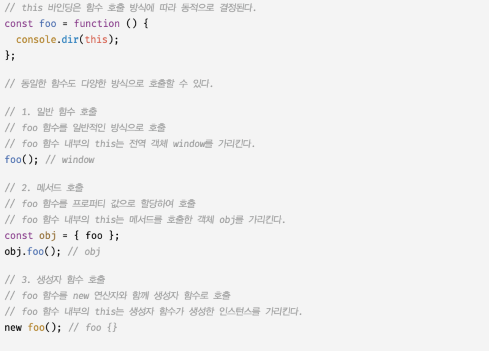
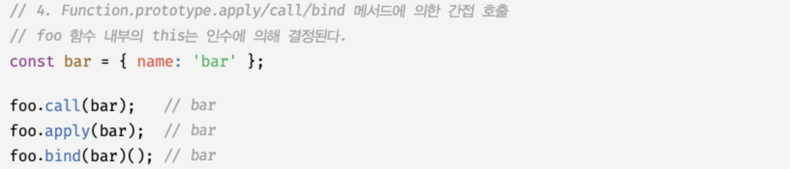
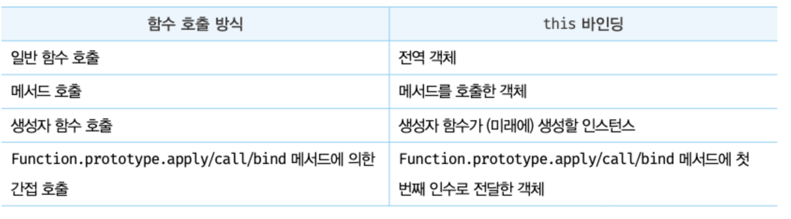

# 22장. this

## 22.1 this 키워드

- 객체는 상태를 나타내는 프로퍼티와 동작을 나타내는 메서드를 하나의 논리적인 단위로 묶은 복합적인 자료구조다.
- 동작을 나타내는 메서드는 자신이 속한 객체의 상태, 즉 프로퍼티를 참조하고 변경할 수 있어야 한다. 이때 메서드가 자신이 속한 객체의 프로퍼티를 참조하려면 먼저 자신이 속한 객체를 가리키는 식별자를 참조할 수 있어야 한다.
- 객체 리터럴 방식으로 생성한 객체의 경우 메서드 내부에서 메서드 자신이 속한 객체를 가리키는 식별자를 재귀적으로 참도할 수 있다.
- this는 자신이 속한 객체 또는 자신이 생성할 인스턴스를 가리키는 자기 참조 변수다. this를 통해 자신이 속한 객체 또는 자신이 생성할 인스턴스의 프로퍼티나 메서드를 참조할 수 있다.
- this가 가리키는 값, 즉 this 바인딩은 함수 호출 방식에 의해 동적으로 결정된다.
- strict mode가 적용된 일반 함수 내부의 this에는 undefined가 바인딩된다. 일반 함수 내부에서는 this를 사용할 필요가 없기 때문이다.

## 22.2 함수 호출 방식과 this 바인딩

this 바인딩(this에 바인딩된 값)은 함수 호출 방식, 즉 함수가 어떻게 호출되었는지에 따라 동적으로 결정된다.

- 동일한 함수도 다양한 방식으로 호출할 수 있다.  
  **함수를 호출하는 방식:**
  1. 일반 함수 호출
  2. 메서드 호출
  3. 생성자 함수 호출
  4. Function.prototype.apply/call/bind 메서드에 의한 간접 호출
     
     

함수 호출 방식에 따라 this바인딩이 어떻게 결정되는지 알아보자.

### 22.2.1 일반 함수 호출

- 기본적으로 this에 전역 객체가 바인딩된다.
- this는 객체의 프로퍼티나 메서드를 참조하기 위한 자기 참조 변수이므로 객체를 생성하지 않는 일반 함수에서 this는 의미가 없다. strict mode가 적용된 일반 함수 내부의 this에는 undefined가 바인딩된다.

### 22.2.2 메서드 호출

- 메서드 내부의 this에는 메서드를 호출한 객체, 즉 메서드를 호출할 때 메서드 이름 앞의 마침표(.) 연산자 앞에 기술한 객체가 바인딩된다.
- 메서드 내부의 this는 메서드를 소유한 객체가 아닌 메서드를 호출한 객체에 바인딩된다.
- 프로토타입 메서드 내부에서 사용된 this도 일반 메서드와 마찬가지로 해당 메서드를 호출한 객체에 바인딩된다.

### 22.2.3 생성자 함수 호출

생성자 함수 내부의 this에는 생성자 함수가 (미래에) 생성할 인스턴스가 바인딩된다.

### 22.2.4 Function.prototype.apply/call/bind 메서드에 의한 간접 호출

apply, call, bind메서드는 Function.prototype의 메서드다. 이들 메서드는 모든 함수가 상속받아 사용할 수 있다.

- Function.prototype.apply, Function.prototype.call 메서드는 this로 사용할 객체와 인수 리스트를 인수로 전달받아 함수로 호출한다.
- apply와 call 메서드의 본질적인 기능은 함수를 호출하는 것이다. 대표적인 용도는 arguments 객체와 같은 유사 배열 객체에 배열 메서드를 사용하는 경우다. arguments 객체는 배열이 아니기 때문에 Array.prototype.slice 같은 배열 메서드를 사용할 수 없으나 apply와 call 메서드를 이용하면 가능하다.
- Function.prototype.bind 메서드는 apply와 call 메서드와 달리 함수를 호출하지 않는다. 첫 번째 인수로 전달한 값으로 this 바인딩이 교체된 함수를 새롭게 생성해 반환한다.
- bind 메서드는 메서드의 this와 메서드 내부의 중첩 함수 또는 콜백 함수 this가 불일치하는 문제를 해결하기 위해 유용하게 사용된다.
- 정리
  
